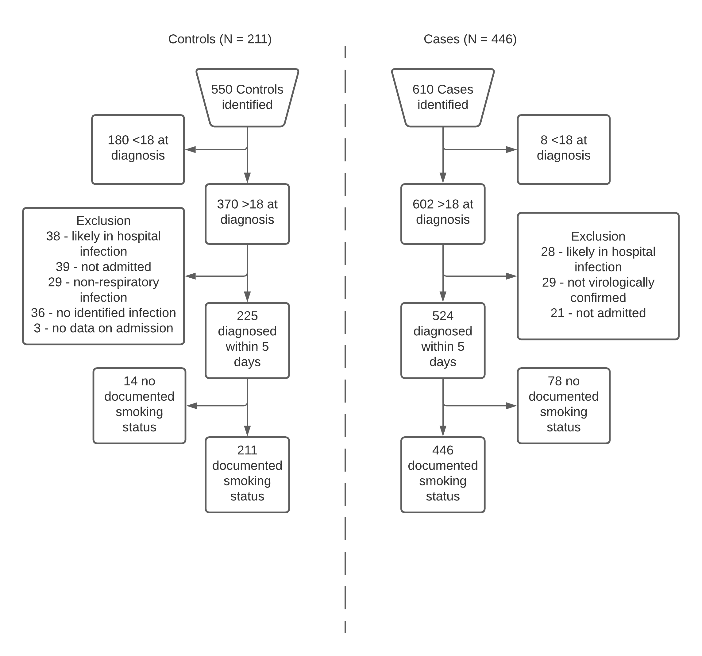
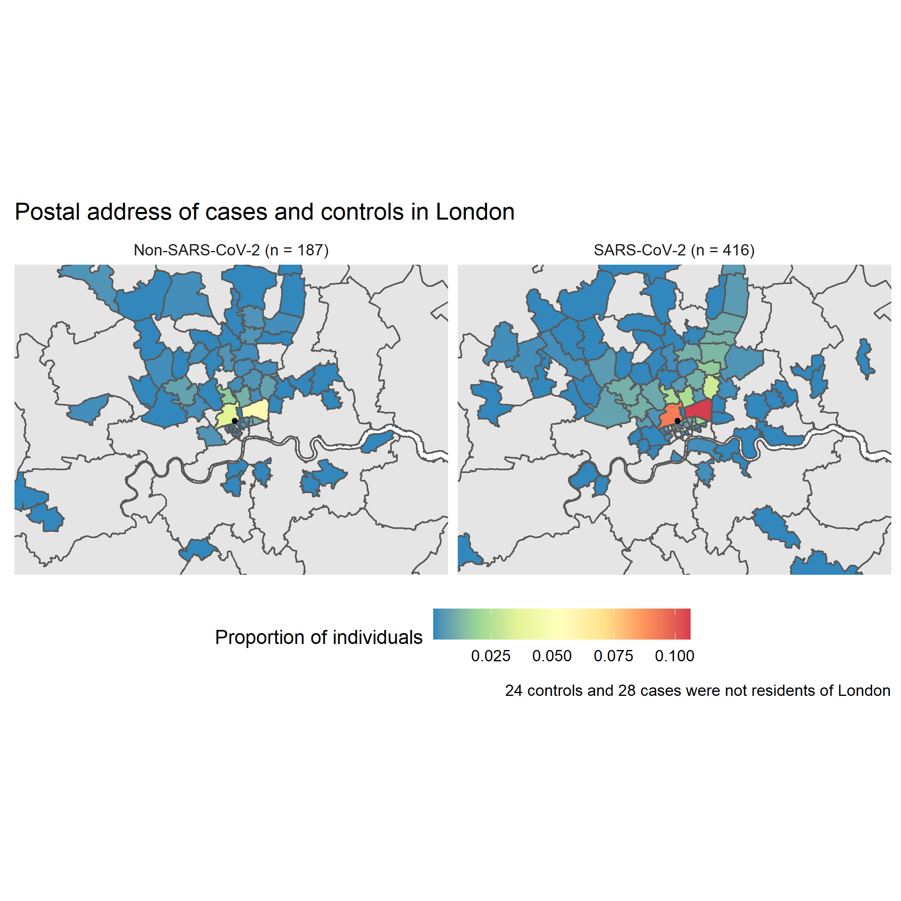

```{r global_options, echo = FALSE, include = FALSE}
options(width = 999)
knitr::opts_chunk$set(echo = FALSE, warning = FALSE, message = FALSE,
                      cache = FALSE, tidy = FALSE, size = "small")
```

```{r setup, include=FALSE}
knitr::opts_chunk$set(echo = TRUE)
```
# **Setup**

### Packages
```{r packages, include=T}
library("tidyverse")
library("readxl")
library("here")
library("arsenal")
library("coin")
library("knitr")
library("sf")
library("rgeos")
library("ggmap")
library("flextable")
library("ggalluvial")
library("viridis")
```

### Data import
``` {r, include=FALSE}
cases <- read_xlsx(here("raw_data", "cases_extracted.xlsx")) %>%
  mutate(cohort = "cases")
controls <- read_xlsx(here("raw_data", "controls_extracted.xlsx")) %>%
  mutate(cohort = "controls")

system_smoking_status <- bind_rows(
  read_csv(here("raw_data", "data_collection_cases.csv")) %>%
    mutate(cohort = "cases",
           icd_10 = "U07.1") %>%
    rename("system_smoking_status" = smoking_status),
  read_csv(here("raw_data", "data_collection_controls.csv")) %>%
    mutate(cohort = "controls")
)
```
# **Abstract**
# **Abstract**
**Background:** Former and current smoking increases the risk of respiratory viral and bacterial infections and is associated with worse outcomes once infected, however, early data from the COVID-19 pandemic have not provided clear evidence for an association of smoking status with the risk of hospitalisation with COVID-19. We estimated whether i) former and current smokers’ risk of hospitalisation with COVID-19 is equivalent to their risk of hospitalisation with other respiratory viruses a year previous, and ii) smoking status recorded on the summary electronic health record (EHR) deviated significantly from that recorded within the contemporaneous medical notes.

**Methods:** This was a retrospective case-control study at a single National Health Service trust in central London, UK. Cases were 446 consecutive adult patients admitted from 1st March 2020 to 26th August 2020 with laboratory confirmed COVID-19 on or during the first five days of admission. Controls were 211 consecutive adult patients admitted from 1st January 2019 to 31st December 2019 with laboratory confirmed respiratory infection (e.g. influenza, respiratory syncytial virus). The outcome variable was type of hospitalisation (i.e. with COVID-19 or another respiratory virus). The exposure variable was smoking status (i.e. never smoker, former smoker, current smoker). Logistic regression analyses without and with adjustment for age, sex, socioeconomic position and comorbidities were performed.

**Findings:** Current (OR~adj~ = 0.55, 95% CI = 0.31-0.96, *p* = .04) but not former smokers (OR~adj~ = 1.08, 95% CI = 0.72-1.65, *p* = .70) had reduced odds of being hospitalised with COVID-19 compared with other respiratory viruses. Current smoking in cases was significantly lower than expected from overall London prevalence (9.4% vs. 12.9%, *p* = .02). In exploratory, age-stratified analyses, current smoking was significantly lower than expected in those aged 45-59 years (4.5% vs 13.8%, *p* <0.01), but not in the other age groups. Smoking status recorded on the summary EHR deviated significantly from that recorded within the contemporaneous medical notes (χ^2^(3) = 226.7, *p* < .001).

**Interpretation:** In a single hospital trust in the UK, current smokers had reduced odds of hospitalisation with COVID-19 compared with other respiratory viruses a year previous. Substantial discordance in the recording of smoking status between the summary EHR and the contemporaneous medical notes was observed.

***

# **Introduction**
COVID-19 is a respiratory disease caused by the SARS-CoV-2 virus. There are in excess of 30 million confirmed cases globally, with over one million deaths reported [@COVID_JH_2020]. Large age and gender differences in case severity and mortality have been observed [@Guan_2020], with hypertension, diabetes and obesity identified as important risk factors [@Fang_2020].

There is reason to believe that current smokers are at increased risk of contracting COVID-19 and greater disease severity once infected. SARS-CoV-2 enters epithelial cells through the ACE-2 receptor [@Hoffman_2020]. Evidence suggests that gene expression and subsequent ACE-2 receptor levels are elevated in the airway and oral epithelium of current smokers [@Brake_2020], potentially making smokers vulnerable to contracting SARS-CoV-2. The regular hand-to-mouth movements involved in cigarette smoking may also increase SARS-CoV-2 transmission. Other studies, however, show that smoking downregulates the ACE-2 receptor [@Oakes_2018]. These uncertainties notwithstanding, both former and current smoking increase the risk of other respiratory viral [@Denholm_2010; @Abadom_2016] and bacterial [@Almirall_1999, @Feldman_2013] infections and are associated with worse outcomes once infected. For example, a large observational study in the UK found that former and current smokers had increased odds of being hospitalised with community-acquired pneumonia compared with never smokers [@Millett_2015]. However, early data from the ongoing pandemic have not provided clear evidence for an association of smoking status with COVID-19 outcomes [@Vardavas_2020; @Alqahtani_2020; @Shahab_2020].

A living evidence review of observational and experimental studies examining the association of smoking status with COVID-19 infection, hospitalisation, disease severity and mortality has found that, among 256 studies, current smoking (not adjusted for age, sex or comorbidities) was generally lower than what would be expected from national current smoking prevalence [@Simons_a_2020]. In addition, current smokers were at reduced risk of testing positive for SARS-CoV-2 compared with never smokers, and former smokers were at increased risk of hospitalisation, disease severity and in-hospital mortality compared with never smokers. However, the majority of included studies were limited by poor recording of smoking status and insufficient adjustment for relevant covariates. Many studies relied on routine electronic health records (EHRs) to obtain individual-level data on demographics, comorbidities and smoking status. However, previous research suggests that data on smoking status obtained via EHRs tend to be incomplete or inaccurate, with implausible longitudinal changes observed [@Polubriaginof_2018]. In addition, as hospitalised populations differ importantly by age and sex from the general population, comparisons of current and former smoking prevalence in hospitalised and non-hospitalised populations are likely limited. There is hence an urgent need for alternative study designs with relevant comparator groups to better understand the association of smoking status with COVID-19 disease outcomes.

We aimed to examine, in a retrospective case-control study conducted at a single UK hospital trust, the association of former and current smoking with hospitalisation for COVID-19 compared with other respiratory virus infections (e.g. influenza, respiratory syncytial virus) a year previous. A secondary aim was to examine whether there is discordance between smoking status recorded on the summary EHR and within the contemporaneous medical notes.

# **Methods**

### *Study design*
This was an observational, retrospective case-control study performed at a single National Health Service (NHS) hospital trust (comprising two hospital sites). The study protocol and analysis plan were pre-registered on the Open Science Framework [@Simons_b_2020]. Ethical approval was obtained from a local research committee and by the NHS Health Research Authority (IRAS_282704), with the requirement for informed consent waived due to the nature of the study.

Controls were consecutive patients admitted to the same hospital trust with other respiratory viral infections a year previous. As SARS-CoV-2 is a respiratory coronavirus transmitted through droplets, patients with other respiratory viruses (e.g. influenza, parainfluenza) were deemed appropriate controls [@Mccarthy_1999]. In addition, risk factors for hospitalisation with other respiratory viruses are similar to those for hospitalisation with COVID-19 (e.g. age, comorbidities) [@Peralta_2010; @Falsey_2014].

For comparison, aggregated data on current smoking prevalence for London was obtained from the Office for National Statistics (ONS) Annual Population Survey [Jarvis_2020].

An *a priori* sample size calculation indicated that 109 controls and 363 cases would provide 80% power to detect a 10% difference in current smoking prevalence between cases and controls, assuming a one-tailed test and with alpha set to 5%. However, as the number of eligible cases and controls exceeded this threshold, we included all cases from 1st March 2020 to the 26th August 2020 (the date on which patient data were obtained) and all controls from the 1st January 2019 and the 31st December 2020.

### *Eligibility criteria*

*Inclusion criteria:*

* Cases
  1. Admitted to an adult hospital ward (i.e. 18+ years) between 1st March 2020 and 26th August 2020
  2. Diagnosis of COVID-19 on or within 5 days of admission, identified via ICD-10 codes
  
* Controls
  1. Admitted to an adult hospital ward (i.e. 18+ years) between 1st January 2019 and 31st December 2019
  2. Diagnosis of a viral respiratory infection on or within 5 days of admission, identified via ICD-10 codes
  
*Exclusion criteria:*

* Cases and controls
  1. No EHR record of smoking status
  2. Primary diagnosis of infectious exacerbation of COPD was excluded due to the strong causal association with current and former smoking

### *Measures*

*Outcome variables*

The primary outcome was type of hospital admission (i.e. with COVID-19 vs. other respiratory viral infection).


*Exposure*

Smoking status (i.e. current, former, never, non-smoker) was obtained from the summary EHR . Where possible, information on use of smokeless tobacco, waterpipe and/or alternative nicotine products was extracted. If smoking status was not documented, the first and second authors searched within the contemporaneous medical records clinic letters and General Practitioner (GP) referral letters) for free-text entries of smoking status. The most recently available record of smoking status was extracted. Where available, data on pack-year history of smoking were extracted. For the primary analysis, patients categorised as a ‘non-smoker’ were treated as ‘never smokers’. A sensitivity analysis was subsequently undertaken with non-smokers excluded from the analysis.


*Covariates*

Covariates were extracted from the summary EHR and included age, sex, ethnicity, socioeconomic position (with post codes linked to the Index of Multiple Deprivation (IMD) [@IMD_2020] and comorbidities (classified by organ system, including cardiac, metabolic and respiratory diseases). Medical conditions not expected to be strongly associated with COVID-19 hospitalisation were not taken into account (e.g. sciatica and fibromyalgia; see Supplementary Material 1). Age was treated as a continuous variable for the primary analysis, with banded age groups (i.e. 18-29 years, 30-44 years, 45-59 years, 60-74 years, 75-89 years and > 90 years) used in exploratory analyses. The IMD was collapsed from deciles to quintiles to reduce the impact of sparse data.

*Data analysis*

All analyses were conducted in R version 4.0.2 [@R_2020]. Descriptive statistics for cases and controls are reported.

Current, former and never smoking prevalence for the control and case populations were compared using Pearson’s Chi-squared tests. Unadjusted and adjusted generalised linear models with a binomial distribution and logit link function were used to examine the association of smoking status with type of hospitalisation. We report odds ratios (ORs) with 95% confidence intervals (CIs).

Pearson’s Chi-squared tests were used to compare smoking status recorded on the summary EHR and the contemporaneous medical notes for the entire sample, and separately for cases and controls.

A series of unplanned, exploratory analyses were also performed. First, one-sided proportional tests (z-tests) were used to compare age-stratified former and current smoking prevalence in cases with recent estimates from the APS. Second, the Cochran-Armitage Chi-squared test for trend was used to compare socioeconomic position in cases and controls. Third, Pearson’s Chi-squared tests were used to compare socioeconomic position in cases and controls for banded age groups.

# Data Cleaning
``` {r data_cleaning, include=T, message=F, warning=F}

if(!file.exists(here("clean_data", "cleaned_data.rds")))
   {
source(here("scripts", "split_multiple.r"))
source(here("scripts", "comorbidities.r"))
full_postcodes <- read_csv(here("raw_data", "individuals_with_full_postcodes.csv")) %>%
  select(mrn, postcode) %>%
  distinct(mrn, postcode)
imd_deciles <- read_csv(here("raw_data", "postcodes_imd.csv")) %>%
  select(Postcode, `Index of Multiple Deprivation Decile`, `Health and Disability Decile`) %>%
  rename("full_postcode" = Postcode,
         "imd_decile" = `Index of Multiple Deprivation Decile`,
         "health_disability_decile" = 3) %>%
  mutate(imd_decile = ifelse(is.na(imd_decile) == T, "Missing*", health_disability_decile)) %>%
  distinct(full_postcode, imd_decile, health_disability_decile)

data <- bind_rows(
  cases %>%
    select(mrn, birthdate, admission_date, sex, postcode, ethnicity, comorbidity, diagnosis, length_admission, smoking_status, pack_years, mortality, include, other, specimen_collection, cohort),
  controls %>%
    select(mrn, birthdate, admission_date, sex, postcode, ethnicity, comorbidity, diagnosis, length_admission, smoking_status, pack_years, mortality, include, other, specimen_collection, cohort)) %>%
  mutate(admission_date = as.Date(admission_date, "%Y%m%d")) %>%
  filter(admission_date >= "2019-01-01")

data <- data %>%
  left_join(.,
            system_smoking_status %>%
              select(mrn, birthdate, age_at_admission, admission_date, system_smoking_status, cohort, icd_10)) %>%
  drop_na(include)

exclude_time_from_admission <- data %>%
  filter(!specimen_collection == is.na(specimen_collection)) %>%
  mutate(time_from_admission = as.numeric(difftime(specimen_collection, admission_date, units = "days")),
         time_from_admission = ifelse(is.na(time_from_admission), 0, time_from_admission),
         smoking_status = ifelse(smoking_status == "occasional_smoker", "current_smoker", smoking_status),
         age_at_admission = as.numeric(difftime(admission_date, birthdate, units = "weeks"))/52.25) %>%
  filter(time_from_admission > 4)

exclude_no_smoking <- data %>%
  filter(smoking_status %in% c("no_record", "no_data", "no_information"))  %>%
  filter(!other %in% c("already_admitted", "no_information")) %>%
  filter(!mrn %in% c(exclude_time_from_admission$mrn))

exclude_other <- data %>%
  filter(include == "n" | other == "already_admitted") %>%
  anti_join(., exclude_time_from_admission, by = c("mrn", "birthdate", "admission_date")) %>%
  anti_join(., exclude_no_smoking, by = c("mrn", "birthdate", "admission_date"))

eligible_data <- data %>%
  anti_join(., exclude_time_from_admission, by = c("mrn", "birthdate", "admission_date")) %>%
  anti_join(., exclude_no_smoking, by = c("mrn", "birthdate", "admission_date")) %>%
  anti_join(., exclude_other, by = c("mrn", "birthdate", "admission_date")) %>%
  bind_cols(split_into_multiple(.$comorbidity, ", ", "comorbidity")) %>%
  mutate(mrn = as_factor(mrn),
         birthdate = as.Date(birthdate, "%Y-%m-%d"),
         admission_date = as.Date(admission_date, "%Y-%m-%d"),
         age_at_admission = as.numeric(difftime(admission_date, birthdate, units = "weeks"))/52.25,
         sex = as_factor(sex %>%
                           recode("m" = "male",
                                  "f" = "female")),
         postcode = as_factor(postcode),
         ethnicity = ifelse(is.na(ethnicity), "not_stated", ethnicity),
         ethnicity = as_factor(ethnicity),
         diagnosis = as_factor(diagnosis),
         smoking_status = as_factor(smoking_status),
         pack_years = as_factor(pack_years),
         mortality = as_factor(mortality),
         system_smoking_status = ifelse(is.na(system_smoking_status), "unknown_smoker", system_smoking_status),
         system_smoking_status = as_factor(system_smoking_status),
         cohort = as_factor(cohort),
         icd_10 = as_factor(icd_10)) %>%
  select(-c(comorbidity, include, specimen_collection))
         
eligible_data <- eligible_data %>%
  mutate(grouped_age = as_factor(cut(age_at_admission, breaks = c(18, 24, 34, 44, 54, 64, max(age_at_admission)))),
         aps_age = as_factor(cut(age_at_admission, breaks = c(18, 29, 44, 59, 74, max(age_at_admission)))),
         mortality = fct_explicit_na(mortality, "alive"),
         cohort = relevel(cohort, ref = "controls"))

eligible_data$smoking_status_sensitivity <- eligible_data$smoking_status
levels(eligible_data$smoking_status) <- c("never_smoker", "former_smoker", "never_smoker", "current_smoker", "current_smoker", "current_smoker")
levels(eligible_data$smoking_status_sensitivity) <- c("never_smoker", "former_smoker", "non_smoker", "current_smoker", "current_smoker", "current_smoker")
levels(eligible_data$system_smoking_status) <- c("never_smoker", "former_smoker", "current_smoker", "unknown_smoker", "unknown_smoker")
levels(eligible_data$grouped_age) <- c("18-24", "25-34", "35-44", "45-54", "55-64", "65+")
levels(eligible_data$aps_age) <- c("18-29", "30-44", "45-59", "60-74", "75+")
levels(eligible_data$ethnicity) <- c("black_african", "white_british", "not_stated", "black_caribbean", "other_asian", "other_white", "other", "asian",
                                     "white_irish", "chinese", "mixed", "other", "asian", "asian", "mixed", "not_stated", "other", "mixed")

eligible_data$comorbidity_1[grepl(paste(cancers, collapse = "|"), eligible_data$comorbidity_1, ignore.case=FALSE)] <- "cancer"
eligible_data$comorbidity_1[grepl(paste(no_comorbidity, collapse = "|"), eligible_data$comorbidity_1, ignore.case=FALSE)] <- "nil"
eligible_data$comorbidity_1 <- replace_na(eligible_data$comorbidity_1, "nil")
eligible_data$comorbidity_1[grepl(paste(auto_immune, collapse = "|"), eligible_data$comorbidity_1, ignore.case=FALSE)] <- "auto_immune"
eligible_data$comorbidity_1[grepl(paste(metabolic, collapse = "|"), eligible_data$comorbidity_1, ignore.case=FALSE)] <- "metabolic"
eligible_data$comorbidity_1[grepl(paste(haematological, collapse = "|"), eligible_data$comorbidity_1, ignore.case=FALSE)] <- "haematological"
eligible_data$comorbidity_1[grepl(paste(cardiac, collapse = "|"), eligible_data$comorbidity_1, ignore.case=FALSE)] <- "cardiac"
eligible_data$comorbidity_1[grepl(paste(neurological, collapse = "|"), eligible_data$comorbidity_1, ignore.case=FALSE)] <- "neurological"
eligible_data$comorbidity_1[grepl(paste(psychiatric, collapse = "|"), eligible_data$comorbidity_1, ignore.case=FALSE)] <- "psychiatric"
eligible_data$comorbidity_1[grepl(paste(respiratory, collapse = "|"), eligible_data$comorbidity_1, ignore.case=FALSE)] <- "respiratory"
eligible_data$comorbidity_1[grepl(paste(renal, collapse = "|"), eligible_data$comorbidity_1, ignore.case=FALSE)] <- "renal"

eligible_data$comorbidity_2[grepl(paste(cancers, collapse = "|"), eligible_data$comorbidity_2, ignore.case=FALSE)] <- "cancer"
eligible_data$comorbidity_2[grepl(paste(no_comorbidity, collapse = "|"), eligible_data$comorbidity_2, ignore.case=FALSE)] <- "nil"
eligible_data$comorbidity_2 <- replace_na(eligible_data$comorbidity_2, "nil")
eligible_data$comorbidity_2[grepl(paste(auto_immune, collapse = "|"), eligible_data$comorbidity_2, ignore.case=FALSE)] <- "auto_immune"
eligible_data$comorbidity_2[grepl(paste(metabolic, collapse = "|"), eligible_data$comorbidity_2, ignore.case=FALSE)] <- "metabolic"
eligible_data$comorbidity_2[grepl(paste(haematological, collapse = "|"), eligible_data$comorbidity_2, ignore.case=FALSE)] <- "haematological"
eligible_data$comorbidity_2[grepl(paste(cardiac, collapse = "|"), eligible_data$comorbidity_2, ignore.case=FALSE)] <- "cardiac"
eligible_data$comorbidity_2[grepl(paste(neurological, collapse = "|"), eligible_data$comorbidity_2, ignore.case=FALSE)] <- "neurological"
eligible_data$comorbidity_2[grepl(paste(psychiatric, collapse = "|"), eligible_data$comorbidity_2, ignore.case=FALSE)] <- "psychiatric"
eligible_data$comorbidity_2[grepl(paste(respiratory, collapse = "|"), eligible_data$comorbidity_2, ignore.case=FALSE)] <- "respiratory"
eligible_data$comorbidity_2[grepl(paste(renal, collapse = "|"), eligible_data$comorbidity_2, ignore.case=FALSE)] <- "renal"

eligible_data$comorbidity_3[grepl(paste(cancers, collapse = "|"), eligible_data$comorbidity_3, ignore.case=FALSE)] <- "cancer"
eligible_data$comorbidity_3[grepl(paste(no_comorbidity, collapse = "|"), eligible_data$comorbidity_3, ignore.case=FALSE)] <- "nil"
eligible_data$comorbidity_3 <- replace_na(eligible_data$comorbidity_3, "nil")
eligible_data$comorbidity_3[grepl(paste(auto_immune, collapse = "|"), eligible_data$comorbidity_3, ignore.case=FALSE)] <- "auto_immune"
eligible_data$comorbidity_3[grepl(paste(metabolic, collapse = "|"), eligible_data$comorbidity_3, ignore.case=FALSE)] <- "metabolic"
eligible_data$comorbidity_3[grepl(paste(haematological, collapse = "|"), eligible_data$comorbidity_3, ignore.case=FALSE)] <- "haematological"
eligible_data$comorbidity_3[grepl(paste(cardiac, collapse = "|"), eligible_data$comorbidity_3, ignore.case=FALSE)] <- "cardiac"
eligible_data$comorbidity_3[grepl(paste(neurological, collapse = "|"), eligible_data$comorbidity_3, ignore.case=FALSE)] <- "neurological"
eligible_data$comorbidity_3[grepl(paste(psychiatric, collapse = "|"), eligible_data$comorbidity_3, ignore.case=FALSE)] <- "psychiatric"
eligible_data$comorbidity_3[grepl(paste(respiratory, collapse = "|"), eligible_data$comorbidity_3, ignore.case=FALSE)] <- "respiratory"
eligible_data$comorbidity_3[grepl(paste(renal, collapse = "|"), eligible_data$comorbidity_3, ignore.case=FALSE)] <- "renal"

eligible_data$comorbidity_4[grepl(paste(cancers, collapse = "|"), eligible_data$comorbidity_4, ignore.case=FALSE)] <- "cancer"
eligible_data$comorbidity_4[grepl(paste(no_comorbidity, collapse = "|"), eligible_data$comorbidity_4, ignore.case=FALSE)] <- "nil"
eligible_data$comorbidity_4 <- replace_na(eligible_data$comorbidity_4, "nil")
eligible_data$comorbidity_4[grepl(paste(auto_immune, collapse = "|"), eligible_data$comorbidity_4, ignore.case=FALSE)] <- "auto_immune"
eligible_data$comorbidity_4[grepl(paste(metabolic, collapse = "|"), eligible_data$comorbidity_4, ignore.case=FALSE)] <- "metabolic"
eligible_data$comorbidity_4[grepl(paste(haematological, collapse = "|"), eligible_data$comorbidity_4, ignore.case=FALSE)] <- "haematological"
eligible_data$comorbidity_4[grepl(paste(cardiac, collapse = "|"), eligible_data$comorbidity_4, ignore.case=FALSE)] <- "cardiac"
eligible_data$comorbidity_4[grepl(paste(neurological, collapse = "|"), eligible_data$comorbidity_4, ignore.case=FALSE)] <- "neurological"
eligible_data$comorbidity_4[grepl(paste(psychiatric, collapse = "|"), eligible_data$comorbidity_4, ignore.case=FALSE)] <- "psychiatric"
eligible_data$comorbidity_4[grepl(paste(respiratory, collapse = "|"), eligible_data$comorbidity_4, ignore.case=FALSE)] <- "respiratory"
eligible_data$comorbidity_4[grepl(paste(renal, collapse = "|"), eligible_data$comorbidity_4, ignore.case=FALSE)] <- "renal"

eligible_data$comorbidity_5[grepl(paste(cancers, collapse = "|"), eligible_data$comorbidity_5, ignore.case=FALSE)] <- "cancer"
eligible_data$comorbidity_5[grepl(paste(no_comorbidity, collapse = "|"), eligible_data$comorbidity_5, ignore.case=FALSE)] <- "nil"
eligible_data$comorbidity_5 <- replace_na(eligible_data$comorbidity_5, "nil")
eligible_data$comorbidity_5[grepl(paste(auto_immune, collapse = "|"), eligible_data$comorbidity_5, ignore.case=FALSE)] <- "auto_immune"
eligible_data$comorbidity_5[grepl(paste(metabolic, collapse = "|"), eligible_data$comorbidity_5, ignore.case=FALSE)] <- "metabolic"
eligible_data$comorbidity_5[grepl(paste(haematological, collapse = "|"), eligible_data$comorbidity_5, ignore.case=FALSE)] <- "haematological"
eligible_data$comorbidity_5[grepl(paste(cardiac, collapse = "|"), eligible_data$comorbidity_5, ignore.case=FALSE)] <- "cardiac"
eligible_data$comorbidity_5[grepl(paste(neurological, collapse = "|"), eligible_data$comorbidity_5, ignore.case=FALSE)] <- "neurological"
eligible_data$comorbidity_5[grepl(paste(psychiatric, collapse = "|"), eligible_data$comorbidity_5, ignore.case=FALSE)] <- "psychiatric"
eligible_data$comorbidity_5[grepl(paste(respiratory, collapse = "|"), eligible_data$comorbidity_5, ignore.case=FALSE)] <- "respiratory"
eligible_data$comorbidity_5[grepl(paste(renal, collapse = "|"), eligible_data$comorbidity_5, ignore.case=FALSE)] <- "renal"

eligible_data$comorbidity_6[grepl(paste(cancers, collapse = "|"), eligible_data$comorbidity_6, ignore.case=FALSE)] <- "cancer"
eligible_data$comorbidity_6[grepl(paste(no_comorbidity, collapse = "|"), eligible_data$comorbidity_6, ignore.case=FALSE)] <- "nil"
eligible_data$comorbidity_6 <- replace_na(eligible_data$comorbidity_6, "nil")
eligible_data$comorbidity_6[grepl(paste(auto_immune, collapse = "|"), eligible_data$comorbidity_6, ignore.case=FALSE)] <- "auto_immune"
eligible_data$comorbidity_6[grepl(paste(metabolic, collapse = "|"), eligible_data$comorbidity_6, ignore.case=FALSE)] <- "metabolic"
eligible_data$comorbidity_6[grepl(paste(haematological, collapse = "|"), eligible_data$comorbidity_6, ignore.case=FALSE)] <- "haematological"
eligible_data$comorbidity_6[grepl(paste(cardiac, collapse = "|"), eligible_data$comorbidity_6, ignore.case=FALSE)] <- "cardiac"
eligible_data$comorbidity_6[grepl(paste(neurological, collapse = "|"), eligible_data$comorbidity_6, ignore.case=FALSE)] <- "neurological"
eligible_data$comorbidity_6[grepl(paste(psychiatric, collapse = "|"), eligible_data$comorbidity_6, ignore.case=FALSE)] <- "psychiatric"
eligible_data$comorbidity_6[grepl(paste(respiratory, collapse = "|"), eligible_data$comorbidity_6, ignore.case=FALSE)] <- "respiratory"
eligible_data$comorbidity_6[grepl(paste(renal, collapse = "|"), eligible_data$comorbidity_6, ignore.case=FALSE)] <- "renal"

eligible_data <- eligible_data %>%
  mutate(comorbidity_1 = as_factor(comorbidity_1),
         comorbidity_2 = as_factor(comorbidity_2),
         comorbidity_3 = as_factor(comorbidity_3),
         comorbidity_4 = as_factor(comorbidity_4),
         comorbidity_5 = as_factor(comorbidity_5),
         comorbidity_6 = as_factor(comorbidity_6),
         cancer = ifelse(eligible_data$comorbidity_1 == "cancer", 1,
                          ifelse(eligible_data$comorbidity_2  == "cancer", 1,
                                 ifelse(eligible_data$comorbidity_3  == "cancer", 1,
                                        ifelse(eligible_data$comorbidity_4  == "cancer", 1,
                                               ifelse(eligible_data$comorbidity_5  == "cancer", 1,
                                                      ifelse(eligible_data$comorbidity_6  == "cancer", 1,
                                                             0)))))),
         cancer = as_factor(ifelse(is.na(cancer), 0, cancer)),
         auto_immune = ifelse(eligible_data$comorbidity_1 == "auto_immune", 1,
                          ifelse(eligible_data$comorbidity_2  == "auto_immune", 1,
                                 ifelse(eligible_data$comorbidity_3  == "auto_immune", 1,
                                        ifelse(eligible_data$comorbidity_4  == "auto_immune", 1,
                                               ifelse(eligible_data$comorbidity_5  == "auto_immune", 1,
                                                      ifelse(eligible_data$comorbidity_6  == "auto_immune", 1,
                                                             0)))))),
         auto_immune = as_factor(ifelse(is.na(auto_immune), 0, auto_immune)),
         metabolic = ifelse(eligible_data$comorbidity_1 == "metabolic", 1,
                          ifelse(eligible_data$comorbidity_2  == "metabolic", 1,
                                 ifelse(eligible_data$comorbidity_3  == "metabolic", 1,
                                        ifelse(eligible_data$comorbidity_4  == "metabolic", 1,
                                               ifelse(eligible_data$comorbidity_5  == "metabolic", 1,
                                                      ifelse(eligible_data$comorbidity_6  == "metabolic", 1,
                                                             0)))))),
         metabolic = as_factor(ifelse(is.na(metabolic), 0, metabolic)),
         haematological = ifelse(eligible_data$comorbidity_1 == "haematological", 1,
                            ifelse(eligible_data$comorbidity_2  == "haematological", 1,
                                   ifelse(eligible_data$comorbidity_3  == "haematological", 1,
                                          ifelse(eligible_data$comorbidity_4  == "haematological", 1,
                                                 ifelse(eligible_data$comorbidity_5  == "haematological", 1,
                                                        ifelse(eligible_data$comorbidity_6  == "haematological", 1,
                                                               0)))))),
         haematological = as_factor(ifelse(is.na(haematological), 0, haematological)),
         cardiac = ifelse(eligible_data$comorbidity_1 == "cardiac", 1,
                          ifelse(eligible_data$comorbidity_2  == "cardiac", 1,
                                 ifelse(eligible_data$comorbidity_3  == "cardiac", 1,
                                        ifelse(eligible_data$comorbidity_4  == "cardiac", 1,
                                               ifelse(eligible_data$comorbidity_5  == "cardiac", 1,
                                                      ifelse(eligible_data$comorbidity_6  == "cardiac", 1,
                                 0)))))),
         cardiac = as_factor(ifelse(is.na(cardiac), 0, cardiac)),
         neurological = ifelse(eligible_data$comorbidity_1 == "neurological", 1,
                          ifelse(eligible_data$comorbidity_2  == "neurological", 1,
                                 ifelse(eligible_data$comorbidity_3  == "neurological", 1,
                                        ifelse(eligible_data$comorbidity_4  == "neurological", 1,
                                               ifelse(eligible_data$comorbidity_5  == "neurological", 1,
                                                      ifelse(eligible_data$comorbidity_6  == "neurological", 1,
                                                             0)))))),
         neurological = as_factor(ifelse(is.na(neurological), 0, neurological)),
         psychiatric = ifelse(eligible_data$comorbidity_1 == "psychiatric", 1,
                          ifelse(eligible_data$comorbidity_2  == "psychiatric", 1,
                                 ifelse(eligible_data$comorbidity_3  == "psychiatric", 1,
                                        ifelse(eligible_data$comorbidity_4  == "psychiatric", 1,
                                               ifelse(eligible_data$comorbidity_5  == "psychiatric", 1,
                                                      ifelse(eligible_data$comorbidity_6  == "psychiatric", 1,
                                                             0)))))),
         psychiatric = as_factor(ifelse(is.na(psychiatric), 0, psychiatric)),
         respiratory = ifelse(eligible_data$comorbidity_1 == "respiratory", 1,
                              ifelse(eligible_data$comorbidity_2  == "respiratory", 1,
                                     ifelse(eligible_data$comorbidity_3  == "respiratory", 1,
                                            ifelse(eligible_data$comorbidity_4  == "respiratory", 1,
                                                   ifelse(eligible_data$comorbidity_5  == "respiratory", 1,
                                                          ifelse(eligible_data$comorbidity_6  == "respiratory", 1,
                                                                 0)))))),
         respiratory = as_factor(ifelse(is.na(respiratory), 0, respiratory)),
         renal = ifelse(eligible_data$comorbidity_1 == "renal", 1,
                              ifelse(eligible_data$comorbidity_2  == "renal", 1,
                                     ifelse(eligible_data$comorbidity_3  == "renal", 1,
                                            ifelse(eligible_data$comorbidity_4  == "renal", 1,
                                                   ifelse(eligible_data$comorbidity_5  == "renal", 1,
                                                          ifelse(eligible_data$comorbidity_6  == "renal", 1,
                                                                 0)))))),
         renal = as_factor(ifelse(is.na(renal), 0, renal)),
         HIV = ifelse(eligible_data$comorbidity_1 == "HIV", 1,
                      ifelse(eligible_data$comorbidity_2  == "HIV", 1,
                             ifelse(eligible_data$comorbidity_3  == "HIV", 1,
                                    ifelse(eligible_data$comorbidity_4  == "HIV", 1,
                                           ifelse(eligible_data$comorbidity_5  == "HIV", 1,
                                                  ifelse(eligible_data$comorbidity_6  == "HIV", 1,
                                                         0)))))),
         HIV = as_factor(ifelse(is.na(HIV), 0, HIV)),
         nil = ifelse(eligible_data$comorbidity_1 == "nil", 1,
                      0),
         nil = as_factor(ifelse(is.na(nil), 0, nil))
  )

eligible_data <- eligible_data %>%
  left_join(., full_postcodes %>%
              rename("full_postcode" = postcode)) %>%
  left_join(., imd_deciles) %>%
  mutate(full_postcode = as_factor(full_postcode),
         imd_decile = as_factor(imd_decile),
         health_disability_decile = as_factor(health_disability_decile))

write_rds(eligible_data, here("clean_data", "cleaned_data.rds"))
}
```

# **Results**

A total of 211 controls and 446 cases were included (see Figure 1). Compared with controls, cases were more likely to be male (55% vs. 35.9%) and older (62.5 vs. 64.9 years old) (see Table 1). Approximately 10% of cases and controls had missing data for ethnicity. Cases were more likely to identify as Black British, Black African or Black Caribbean ethnicity compared with controls (14.1% vs. 9%, *p* < 0.001). Controls were more likely to come from more deprived areas (IMD quintiles 1 and 2) than cases (41.8% vs. 32.9%, *p* < 0.001). Compared with controls, cases were more likely to have pre-existing metabolic (30.3% vs 13.3%) and cardiac comorbidities (53.4% vs 30.3%).

```{r descriptive_analysis, include=FALSE}
data <- read_rds(here("clean_data", "cleaned_data.rds")) %>%
  mutate(length_admission = ifelse(mortality == "died", NA, length_admission),
         three_age = as.factor(ifelse(grouped_age %in% c("18-24", "25-34", "35-44"), 1,
                            ifelse(grouped_age %in% c("45-54", "55-64"), 2, 3))))

london_smoking <- read_xlsx(here("raw_data", "aps_data.xlsx")) 

table(data$cohort)  

levels(data$sex) <- c("Male", "Female")
levels(data$ethnicity) <- c("Black British, Black African or Black Caribbean", "White British or White Other", "Not stated",
                            "Black British, Black African or Black Caribbean", "Asian British or Asian", "White British or White Other", "Other",
                            "Asian British or Asian", "White British or White Other", "Asian British or Asian", "Other")
levels(data$smoking_status) <- c("Never smoker", "Former smoker", "Current smoker")
levels(data$system_smoking_status) <- c("Never smoker", "Former smoker", "Current smoker", "Unknown")
levels(data$diagnosis) <- c("SARS-CoV-2", "Influenza A", "Multiple non-SARS-CoV-2", "Influenza B",
                            "RSV", "Multiple non-SARS-CoV-2", "Adenovirus", "Coronavirus (non-SARS-CoV-2)",
                            "Parainfluenza", "Influenza A", "Rhinovirus", "Influenza A", "Multiple non-SARS-CoV-2",
                            "Metapneumovirus", "Multiple non-SARS-CoV-2", "Multiple non-SARS-CoV-2", "Multiple non-SARS-CoV-2",
                            "Multiple non-SARS-CoV-2", "Multiple non-SARS-CoV-2", "Multiple non-SARS-CoV-2", "Multiple non-SARS-CoV-2",
                            "Multiple non-SARS-CoV-2", "Multiple non-SARS-CoV-2")
levels(data$mortality) <- c("Died during admission", "Survived admission")
levels(data$cancer) <- c("Absent", "Present")
levels(data$auto_immune) <- c("Absent", "Present")
levels(data$metabolic) <- c("Absent", "Present")
levels(data$haematological) <- c("Absent", "Present")
levels(data$cardiac) <- c("Absent", "Present")
levels(data$neurological) <- c("Absent", "Present")
levels(data$respiratory) <- c("Absent", "Present")
levels(data$renal) <- c("Absent", "Present")
levels(data$HIV) <- c("Absent", "Present")
levels(data$nil) <- c("At least one", "No comorbidities")
levels(data$three_age) <- c("18-44", "45-64", "65+")
levels(data$cohort) <- c("Controls", "Cases")
data$imd_decile <- factor(data$imd_decile)
data$imd_quintile <-   plyr::mapvalues(data$imd_decile,
                                           from = c("1", "2", "3", "4", "5", "6", "7", "8", "9", "10", "Missing*"),
                                           to = c("1 - Most deprived", "1 - Most deprived", "2", "2", "3", "3", "4", "4", "5 - Least deprived", "5 - Least deprived", "Missing*"))
data$imd_quintile <- factor(data$imd_quintile, levels = c("Missing*", "1 - Most deprived", "2", "3", "4", "5 - Least deprived"))

mylabels <- list(sex = "Female",
                 age_at_admission = "Age",
                 aps_age = "Categorical age",
                 ethnicity = "Ethnicity",
                 smoking_status = "Smoking status",
                 system_smoking_status = "System recorded smoking status",
                 diagnosis = "Diagnosis",
                 length_admission = "Length of admission for survivors (days)",
                 mortality = "Survival to discharge",
                 cancer = "Cancer (current or past)",
                 auto_immune = "Auto-immune disease (present)",
                 metabolic = "Metabolic disease (present)",
                 haematological = "Haematological disease (present)",
                 cardiac = "Cardiac disease (present)",
                 neurological = "Neurological disease (present)",
                 respiratory = "Respiratory disease (present)",
                 renal = "Renal disease (present)",
                 HIV = "HIV (present)",
                 nil = "No relevant comorbidities",
                 three_age = "Grouped age",
                 cohort = "Cohort",
                 imd_quintile = "IMD quintile")

t1 <- tableby(cohort ~ sex +
                age_at_admission +
                trend(aps_age) +
                ethnicity +
                imd_quintile +
                smoking_status +
                system_smoking_status +
                mortality +
                anova(length_admission, "median", "q1q3") +
                cancer +
                auto_immune +
                metabolic +
                haematological +
                cardiac +
                neurological +
                respiratory +
                renal +
                HIV +
                nil,
              data = data,
              numeric.stats=c("median","q1q3"),
              cat.simplify = T)

write_rds(data, here("clean_data", "data_for_analysis.rds"))
```

#### Figure 1: study population


***

A significantly larger proportion of cases compared with controls died during their hospital admission (28.7% vs. 4.3%). For patients who survived to discharge, the median length of hospital stay for cases and controls was 9 (IQR = 4-18) and 4 (IQR = 2-9) days, respectively.

#### Table 1: population characteristics
``` {r table_1, results='asis'}
summary(t1, text = T, labelTranslations = mylabels, digits = 2)

pack_year <- bind_rows(cases, controls) %>%
  drop_na(pack_years) %>%
  filter(!pack_years %in% c("nil", "na", "no_information", "not_recorded")) %>%
  group_by(cohort, smoking_status) %>%
  mutate(pack_years = as.numeric(pack_years)) %>%
  summarise(med_py = median(pack_years),
            x = quantile(pack_years, c(0.25, 0.75)))

```
*^"IMD values are not available for individuals with home addresses outside of the UK"^

---

Controls and cases were predominantly admitted from North central and North East central London (see Figure 2). The number of cases admitted from peripheral locations was higher than in controls and represents transfer of inpatients from other hospitals and diversion of patients that would otherwise have attended local hospitals due to bed pressures.

``` {r geographic_data, include=FALSE}
if(!file.exists(here("output", "higher_level_map.png")))
{
UK <- st_read(here::here("gov_data", "GB_Postcodes", "PostalArea.shp"))

data <- read_rds(here::here("clean_data", "cleaned_data.rds")) %>%
  mutate(postcode = as.character(plyr::revalue(postcode, c("America" = NA, "Australia" = NA, "Canada" = NA,
                                                           "Portugal" = NA, "Sweden" = NA, "ZZ99 3" = NA))),
         region_postcode = substr(postcode, 1, nchar(postcode)),
         region_postcode = str_replace_all(region_postcode, "[:space:]", "")) %>%
  filter(postcode != is.na(postcode))  %>%
  group_by(region_postcode, cohort) %>%
  summarise(count = n()) %>%
  ungroup(region_postcode) %>%
  mutate(freq = count/sum(count)) %>%
  group_by(region_postcode)

levels(data$cohort) <-  c("Non-SARS-CoV-2 (n = 206)", "SARS-CoV-2 (n = 442)")

postcodes <- unique(data$region_postcode)

all <- st_read(here::here("gov_data", "GB_Postcodes", "PostalSector.shp"))

test <- all
test$RMSect <- str_replace(test$RMSect, "[:space:]", "")
test <- test %>%
  filter(RMSect %in% postcodes)

minx <- st_bbox(test %>%
                  filter(Sprawl == "London"))[1]
maxx <- st_bbox(test %>%
                  filter(Sprawl == "London"))[3]
miny <- st_bbox(test %>%
                  filter(Sprawl == "London"))[2]
maxy <- st_bbox(test %>%
                  filter(Sprawl == "London"))[4]
test <- left_join(test %>%
                    rename("postcode" = RMSect),
                  data %>%
                    rename("postcode" = region_postcode),
                  by = "postcode")

hospital <- test %>%
  filter(RefPC == "NW12LW") %>%
  as_tibble() %>%
  select(x, y) %>%
  distinct()

outside_london <- test %>%
  as_tibble() %>%
  filter(Sprawl != "London") %>%
  group_by(cohort) %>%
  summarise(sum = sum(count))

postal_district <- st_read(here::here("gov_data", "GB_Postcodes", "PostalDistrict.shp"))

higher_level <- data %>%
  mutate(postal_district = substr(region_postcode, 1, nchar(region_postcode)-1)) %>%
  select(-region_postcode) %>%
  group_by(postal_district, cohort) %>%
  summarise(count = sum(count),
            freq = sum(freq))

postal_district$PostDist <- str_replace(postal_district$PostDist, "[:space:]", "")
postal_district <- postal_district %>%
  filter(PostDist %in% higher_level$postal_district)

higher_level <- left_join(postal_district %>%
                            rename("postcode" = PostDist),
                          higher_level %>%
                            rename("postcode" = postal_district),
                          by = "postcode")

hl_map <- ggplot()+
  geom_sf(data = UK) +
  geom_sf(data = higher_level, aes(fill = freq), inherit.aes = F) +
  geom_point(data = hospital, aes(x = x, y = y), size = 1, colour = "black", inherit.aes = F) +
  coord_sf(xlim = c(minx, maxx),
           ylim = c(miny, maxy)) +
  facet_wrap(~ cohort) +
  theme_minimal() +
  theme(axis.title = element_blank(),
        axis.text = element_blank(),
        axis.ticks = element_blank(),
        legend.position = "bottom") +
  scale_fill_distiller(palette = "Spectral",
                       guide = guide_colourbar(barwidth = 10, direction = "horizontal")) +
  labs(title = "Postal address of cases and controls in London",
       fill = "Proportion of individuals",
       caption = "24 controls and 28 cases resided outside of London")

ggsave("higher_level_map.png", plot = hl_map, path = here("report", "figures"), dpi = 320)
}
```

#### Figure 2: patients home addresses in London


***

#### *Association of smoking status with type of hospitalisation *

The prevalence of former smoking was higher in cases compared with controls (38.6% vs. 31.8%). Current smoking prevalence was higher in controls compared with cases (17.1% vs. 9.4%). A single patient from the case cohort was recorded as a dual cigarette and e-cigarette user. Two patients, one from each cohort, were recorded as dual cigarette and shisha/waterpipe users.

In the univariable analysis, current smokers had significantly reduced odds of being hospitalised with COVID-19 compared with other respiratory viruses (OR = 0.52, 95% CI = 0.31-0.86, *p* = 0.01). The odds for former smokers were equivocal (OR = 1.16, 95% CI = 0.81-1.68, *p* = 0.43).

In the multivariable analysis adjusted for sex, age, socioeconomic position and comorbidities, current smokers had significantly reduced odds of being hospitalised with COVID-19 compared with other respiratory viruses (OR = 0.55, 95% CI = 0.31-0.96, *p* = 0.04). The odds for former smokers were equivocal (OR = 1.08, 95% C.I. = 0.72-1.61, *p* = 0.70).

``` {r statistical_analysis, include=FALSE}
data <- read_rds(here("clean_data", "data_for_analysis.rds")) %>%
  filter(imd_quintile != "Missing*")

unadjusted <- glm(cohort ~ smoking_status, data = data, family = binomial(link = "logit"))
minimally_adjusted <- glm(cohort ~ smoking_status + sex + age_at_admission + imd_quintile, data = data, family = binomial(link = "logit"))
fully_adjusted <- glm(cohort ~ smoking_status + sex + age_at_admission + 
                      cancer + auto_immune + metabolic + haematological + cardiac + neurological + respiratory + renal + HIV + nil + imd_quintile,
                      data = data, family = binomial(link = "logit"))
age_interaction <- glm(cohort ~ smoking_status + age_at_admission + sex +
                      cancer + auto_immune + metabolic + haematological + cardiac + neurological + respiratory + renal + HIV + nil,
                      data = data, family = binomial(link = "logit"))

summary(unadjusted)
summary(minimally_adjusted)
summary(fully_adjusted)
summary(age_interaction)
summary(fully_adjusted)$coefficients[,4] 
confint(minimally_adjusted)

exp(cbind(OR = coef(unadjusted), confint(unadjusted)))
exp(cbind(OR = coef(minimally_adjusted), confint(minimally_adjusted)))
exp(cbind(OR = coef(fully_adjusted), confint(fully_adjusted)))
exp(cbind(OR = coef(age_interaction), confint(age_interaction)))
```

``` {r unadjusted, message=F}
a <- cbind(exp(cbind(OR = coef(unadjusted), confint(unadjusted))), p = round(summary(unadjusted)$coefficients[,4], 3))
kable(a[2:3,] %>%
  as_tibble() %>%
  cbind("Smoking status" = c("Former smoker", "Current smoker")) %>%
  mutate(OR = round(OR, 2),
         `2.5 %` = round(`2.5 %`, 2),
         `97.5 %` = round(`97.5 %`, 2),
         p = round(p, 2)) %>%
  rename("Odds ratio" = 1, "2.5% CI" = 2, "97.5% CI" = 3, "p" = 4) %>%
  select(c("Smoking status", "Odds ratio", "2.5% CI", "97.5% CI", "p")))
```

``` {r adjusted, message=F}
a <- cbind(exp(cbind(OR = coef(fully_adjusted), confint(fully_adjusted))), p = round(summary(fully_adjusted)$coefficients[,4], 3))
kable(a[2:3,] %>%
  as_tibble() %>%
  cbind("Smoking status" = c("Former smoker", "Current smoker")) %>%
  mutate(OR = round(OR, 2),
         `2.5 %` = round(`2.5 %`, 2),
         `97.5 %` = round(`97.5 %`, 2),
         p = round(p, 2)) %>%
  rename("Adjusted odds ratio" = 1, "2.5% CI" = 2, "97.5% CI" = 3, "p" = 4) %>%
  select(c("Smoking status", "Adjusted odds ratio", "2.5% CI", "97.5% CI", "p")))
```

#### *Sensitivity analysis*

In the sensitivity analysis with individuals recorded as non-smokers excluded from the sample (leaving 159 controls and 398 cases), current smokers had significantly reduced odds of being hospitalised with COVID-19 compared with other respiratory viruses (OR = 0.41, 95% CI = 0.22-0.74, *p* = 0.03). The odds for former smokers were equivocal (OR = 0.78, 95% C.I. = 0.49-1.23, *p* = 0.28).

In exploratory, age-stratified analyses, there was no evidence of lower than expected current smoking prevalence in controls compared with overall London prevalence (see Table 2). In cases, however, current smoking in those aged 45-59 years was significantly lower than expected on the basis of age-matched London prevalence (4.5% vs. 13.8%, *p* = 0.003).

## Proportion Z-tests comparing smoking among cases and controls to London prevalence

``` {r z_tests, include=FALSE}
#Z-test
smoking_proportions <- read_rds(here("clean_data", "cleaned_data.rds")) %>%
  mutate(length_admission = ifelse(mortality == "died", NA, length_admission),
         three_age = as.factor(ifelse(grouped_age %in% c("18-24", "25-34", "35-44"), 1,
                                      ifelse(grouped_age %in% c("45-54", "55-64"), 2, 3))),
         aps_age = as_factor(cut(age_at_admission, breaks = c(18, 30, 45, 60, 75, max(age_at_admission))))) %>%
  group_by(three_age, aps_age, smoking_status, cohort)
levels(smoking_proportions$aps_age) <- c("18-29", "30-44", "45-59", "60-74", "75+")

study_rates <- smoking_proportions %>%
  group_by(aps_age, smoking_status, cohort) %>%
  summarise(n = n()) %>%
  mutate(frequency = n/sum(n))

london_smoking <- read_xlsx(here("raw_data", "aps_data.xlsx")) %>%
  group_by(sex, ethnicity, smoking_status) %>%
  rename("18_29" = "18_29_e",
         "30_44" = "30_44_e",
         "45_59" = "45_59_e",
         "60_74" = "60_74_e",
         "75+" = "75+_e") %>%
  select(sex, smoking_status, "18_29", "30_44", "45_59", "60_74", "75+")
london_xtab <- london_smoking %>%
  select(sex, smoking_status, "18_29", "30_44", "45_59", "60_74", "75+", ethnicity) %>%
  drop_na() %>%
  pivot_longer(cols = c("18_29", "30_44", "45_59", "60_74", "75+"), names_to = "aps_age", values_to = "percentage") %>%
  ungroup() %>%
  select(-ethnicity)
```

``` {r smoking_table, warning = F}
source(here("scripts", "crosstab_functions.R"))
xtable <- crosstab(smoking_proportions, row.vars = c("aps_age"), col.vars = c("cohort","smoking_status"), type = c("f","r"), dec.places = 1)

weighting <- smoking_proportions %>%
  ungroup() %>%
  filter(cohort == "cases") %>%
  select(aps_age, sex) %>%
  group_by_all() %>%
  summarise(n = n()) %>%
  mutate(proportion = n/sum(n))

weighted_mean <- london_xtab %>%
  mutate(aps_age = recode(aps_age, 
                          "18_29" = "18-29",
                          "30_44" = "30-44",
                          "45_59" = "45-59",
                          "60_74" = "60-74")) %>%
  left_join(., weighting) %>%
  mutate(weighted_percentage = percentage * proportion) %>%
  ungroup() %>%
  group_by(smoking_status, aps_age) %>%
  summarise(weighted_percentage = sum(weighted_percentage)) %>%
  mutate(cohort = "london")

read_xlsx(here("clean_data", "smoking_table.xlsx")) %>%
  drop_na() %>%
  select(1:10) %>%
  mutate(london_current_smoker = paste(london_current_smoker*100, "%", sep = ""),
         london_former_smoker = paste(london_former_smoker*100, "%", sep = ""),
         london_never_smoker = paste(london_never_smoker*100, "%", sep = ""),
         age = recode(age, "18_29" = "18-29",
                      "30_44" = "30-44",
                      "45_59" = "40-59",
                      "60_74" = "60-74")) %>%
  flextable() %>%
  set_header_labels(.,
                    values = list(age = "Age",
                                  controls_current_smoker = "Current smoker",
                                  controls_former_smoker ="Former smoker",
                                  controls_never_smoker = "Never smoker",
                                  cases_current_smoker = "Current smoker",
                                  cases_former_smoker = "Former smoker",
                                  cases_never_smoker = "Never smoker",
                                  london_current_smoker = "Current smoker",
                                  london_former_smoker = "Former smoker",
                                  london_never_smoker = "Never smoker")) %>%
  add_header_row(., values = c("", "Controls", "Cases", "London (%)"), colwidths = c(1, 3, 3, 3)) %>%
  align(., align = "center", part = "all") %>%
  autofit() %>%
  border_outer(., part = "all")
```

``` {r exploratory_analysis_1}
cohort_smoking <- smoking_proportions %>%
  ungroup() %>%
  select(cohort, aps_age, smoking_status) %>%
  group_by_all() %>%
  filter(cohort == "cases") %>%
  summarise(n = n()) %>%
  mutate(proportion = n/sum(n)) %>%
  select(-n)
london_smoking <- weighted_mean %>%
  mutate(proportion = weighted_percentage/100) %>%
  select(-weighted_percentage)

exploratory_1 <- cohort_smoking %>%
  bind_rows(london_smoking) %>%
  mutate(cohort = as_factor(cohort),
         aps_age = as_factor(aps_age),
         smoking_status = as_factor(smoking_status))

```
In age-stratified analyses, there was no evidence of reduced smoking prevalence in controls compared with overall London prevalence. In cases, however, current smoking in those aged 45-59 years was significantly lower than age-matched London prevalence (4.5% vs. 13.8%, *p* = 0.003).

There was no difference in socioeconomic position between cases and controls (χ^2^(3) = 8.93, *p* = 0.06) (see Figure 3). However, among those aged 45-59 years old, where current smoking prevalence was lower than expected, cases were less likely to be from areas with higher levels of deprivation than controls (IMD quintiles 1 and 2) (χ^2^(1) = 4.88, *p* = 0.03).

``` {r imd_plots, warning = F}
data <- read_rds(here("clean_data", "data_for_analysis.rds")) %>%
  filter(imd_quintile != "Missing*")

imd_plot <- data %>%
  group_by(cohort, aps_age, imd_quintile) %>%
  ggplot(aes(x = cohort, fill = imd_quintile)) +
  geom_bar(position = "fill") +
  facet_wrap(~ aps_age) +
  theme_minimal() +
  labs(title = element_blank(),
       fill = "IMD Quintile") +
  xlab("Cohort") +
  ylab("Proportion") +
  scale_fill_viridis(discrete = T)

imd_model <- data %>%
  droplevels(data$imd_quintile)
tbl <- table(imd_model$cohort, imd_model$imd_quintile)
imd_chi <- chisq.test(tbl)

ggsave("imd_plot.png", plot = imd_plot, path = here("report", "figures"), dpi = 320)
```

There was no difference in the IMD quintile for those admitted to hospital in the cases or control population (χ^2^(3) = 8.93, *p* = 0.06). However, among those aged 45-59 years old, where current smoking prevalence was lower than expected, cases were less likely to be admitted from areas with higher levels of deprivation than controls (IMD quintiles 1 + 2 and 3 + 4 combined) (χ^2^(1) = 4.88, *p* = 0.03).

## Smoking record discrepency
``` {r discrepency_record}
data <- read_rds(here("clean_data", "data_for_analysis.rds"))
  
count_disc <- data %>%
  droplevels(.$cohort) %>%
  select(mrn, smoking_status, system_smoking_status, cohort) %>%
  mutate(disc = ifelse(as.character(smoking_status) == as.character(system_smoking_status), 0, 1)) %>%
  group_by(cohort) %>%
  summarise(discrepency = sum(disc))

#Recorded smoking status
discrepancies <- data %>%
  droplevels(.$cohort) %>%
  select(mrn, smoking_status, system_smoking_status, cohort) %>%
  pivot_longer(., 2:3, names_to = "record_type") %>%
  mutate(record_type = as_factor(record_type)) %>%
  group_by(cohort)
levels(discrepancies$cohort) <- c("Controls", "Cases")
levels(discrepancies$record_type) <- c("Medical Notes", "Summary EHR")
levels(discrepancies$value) <- c("Never smoker", "Former smoker", "Current smoker", "Unknown")

discrepancies_cases <- discrepancies %>%
  ungroup() %>%
  filter(cohort == "Cases")

discrepancies_controls <- discrepancies %>%
  ungroup() %>%
  filter(cohort == "Controls")

alluvial  <- data %>%
  droplevels(.$cohort) %>%
  select(mrn, smoking_status, system_smoking_status, cohort) %>%
  mutate(frequency = 1) %>%
  rename("Cohort" = cohort)

levels(alluvial$smoking_status) <- c("Never smoker", "Former smoker", "Current smoker")
levels(alluvial$system_smoking_status) <- c("Never smoker", "Former smoker", "Current smoker", "Unknown status")
levels(alluvial$Cohort) <- c("Controls", "Cases")

alluvial_plot <- ggplot(data = alluvial,
       aes(axis1 = system_smoking_status, axis2 = smoking_status)) +
  scale_x_discrete(limits = c("Summary EHR", "Medical records"), expand = c(.2, .05)) +
  geom_flow(aes(fill = Cohort)) +
  geom_stratum() +
  geom_text(stat = "stratum", aes(label = after_stat(stratum))) +
  theme_minimal() +
  ylab("Number of individuals")

ggsave("alluvial.png",
  alluvial_plot,
  path = here("output"))

alluvial_plot

alluvial %>%
  filter(as.character(.$smoking_status) != as.character(.$system_smoking_status)) %>%
  filter(Cohort == "Cases") %>%
  select(-mrn, -frequency, -Cohort) %>%
  table()

alluvial %>%
  filter(as.character(.$smoking_status) != as.character(.$system_smoking_status)) %>%
  filter(Cohort == "Controls") %>%
  select(-mrn, -frequency, -Cohort) %>%
  table()

table_discrepancies <- table(discrepancies$record_type, discrepancies$value)
table_discrepancies_cases <- table(discrepancies_cases$record_type, discrepancies_cases$value)
table_discrepancies_controls <- table(discrepancies_controls$record_type, discrepancies_controls$value)
```

Compared with cases, controls were more likely to have no recorded smoking status on the summary EHR (75.4% vs. 7%). Smoking status in the summary EHR was incorrectly recorded for 168 controls and 60 cases (χ^2^(3) = 226.7, *p* = < 0.001). The difference between the smoking status on the summary EHR and within the contemporaneous medical notes was greater for controls (χ^2^(3) = 256.5, *p* = < 0.001) than for cases (χ^2^(3) = 34.2, *p* = < 0.001).

``` {r chi_square_test, include = F}
chisq.test(table_discrepancies)
chisq.test(table_discrepancies_cases)
chisq.test(table_discrepancies_controls)
```

# **Discussion**

This retrospective case-control study included patients admitted to a single UK hospital trust in central London. We found a lower proportion of current smokers among cases admitted to hospital with COVID-19 during the first phase of the pandemic compared with controls admitted to hospital for other respiratory viral infections a year previous. The difference in smoking status remained following adjustment for sex, age, socioeconomic position and comorbidities. In further exploratory analyses, the lower prevalence of current smoking in cases appeared driven by a lower rate of current smoking in those aged 45-59 years, with more similar to expected prevalence in the other age groups. Cases aged 45-59 were more likely to come from less deprived areas than controls; this may partly explain the lower smoking prevalence in this age group as smoking status is strongly associated with socio-economic position [ref].

We further found that smoking status is typically poorly recorded in the summary EHR. This was more prominent in controls than cases -  a difference that is likely explained by the observation that COVID-19 patients were followed up by the respiratory medicine team after discharge as part of a COVID-19 follow-up clinic where they specifically asked about smoking status. This discrepancy between smoking status recorded on summary EHRs and contemporaneous medical notes  is a concern, particularly for studies relying solely on EHRs as the source of information on smoking status.


# **Limitations**

As current smoking is expected *a priori* to be associated with hospital admission for non-COVID-19 respiratory viruses [@Stampfli_2009], the use of this population as controls may have biased towards the null the association between smoking status and type of hospitalisation due to greater smoking prevalence in controls compared with the general  population at risk of COVID-19 [@Vandenbroucke_2012]. To minimise the impact of this on the interpretation of the results, we included a community-level comparator of smoking prevalence in London derived from a nationally representative sample. 

The control sample selected for comparison  was selected to reflect observed commonalities between the transmission of respiratory viruses. However, emerging evidence suggests that COVID-19 has a significantly different pathological process than other respiratory viruses. For example, mortality rates from COVID-19 differ widely from those due to epidemic influenza [@ONS_2020]. In addition, the risk of superadded bacterial infection in COVID-19 patients appears lower than for those infected with influenza [@Lansbury_2020] and COVID-19 patients have increased rates of coagulopathies compared with those infected with other respiratory viruses [@Klok_2020]. Taken together, these factors may limit the comparability of the risk profiles of cases and controls.

A history of current or past cancer was generally high in both groups at greater than 20% and was significantly greater in controls (31.3%). This reflect a bias in the population that regularly accesses this specific hospital trust. As the study site is a specialist cancer referral centre, we explored where patients admitted to the hospital lived to explore any systemic differences between cases and controls. The differing catchment areas of the two cohorts may have lead to important differences in the underlying populations comprising the cases and controls. In addition, during the peak of the first stage of the pandemic, many cases were transferred from other hospital sites due to bed pressures.


# **Implications and avenues for future research**

COVID-19 will continue to place a huge burden on healthcare services in the UK and internationally over the coming months and years. To mitigate this impact, multiple non-pharmacological interventions are being implemented to reduce the intensity of demand on acute and intensive services. Smoking is a significant cause for healthcare demand globally. We have argued elsewhere for the need to ramp up smoking cessation support to reduce the current and future burden on healthcare services [@Simons_c_2020]. Evidence for any increased risk of smoking on healthcare demand during a global pandemic could support the development and implementation of tailored stop smoking support and help direct limited resources to this at-risk population.

# *Avenues for future research*

To better understand the role of smoking as a risk factor for disease severity or hospitalisation, longitudinal, representative population level studies from multiple sites are required. A large multinational clinical cohort study (ISARIC) collects smoking status but this is likely obtained from summary EHRs. Purposeful acquisition of accurate smoking status is required to characterise the role of smoking in COVID-19.

# *Conclusion*

In this case-control study at a single hospital trust in the UK, current smokers had reduced odds of hospitalisation with COVID-19 compared with other respiratory viruses a year previous. Smoking status was poorly, there was high discordance between the smoking status of individuals recorded in the summary electronic health record and the contemporaneous medical notes.

# **Supplementary material**
Codelists

# **Sensitivity analyses**
``` {r sensitvity_analysis}
sens <- read_rds(here("clean_data", "data_for_analysis.rds")) %>%
  filter(imd_quintile != "Missing*") %>%
  filter(smoking_status_sensitivity != "non_smoker")

a <- table(sens$cohort, sens$smoking_status)

fully_adjusted_sens <- glm(cohort ~ smoking_status + sex + age_at_admission + 
                      cancer + auto_immune + metabolic + haematological + cardiac + neurological + respiratory + renal + HIV + nil + imd_quintile,
                      data = sens, family = binomial(link = "logit"))

a <- summary(fully_adjusted_sens)
a <- summary(fully_adjusted_sens)$coefficients[,4] 

a <- exp(cbind(OR = coef(fully_adjusted_sens), confint(fully_adjusted_sens)))
```

``` {r sens_2 }
source(here("scripts", "split_multiple.r"))
source(here("scripts", "comorbidities.r"))
full_postcodes <- read_csv(here("raw_data", "individuals_with_full_postcodes.csv")) %>%
  select(mrn, postcode) %>%
  distinct(mrn, postcode)
imd_deciles <- read_csv(here("raw_data", "postcodes_imd.csv")) %>%
  select(Postcode, `Index of Multiple Deprivation Decile`, `Health and Disability Decile`) %>%
  rename("full_postcode" = Postcode,
         "imd_decile" = `Index of Multiple Deprivation Decile`,
         "health_disability_decile" = 3) %>%
  mutate(imd_decile = ifelse(is.na(imd_decile) == T, "Missing*", health_disability_decile)) %>%
  distinct(full_postcode, imd_decile, health_disability_decile)

data <- bind_rows(
  cases %>%
    select(mrn, birthdate, admission_date, sex, postcode, ethnicity, comorbidity, diagnosis, length_admission, smoking_status, pack_years, mortality, include, other, specimen_collection, cohort),
  controls %>%
    select(mrn, birthdate, admission_date, sex, postcode, ethnicity, comorbidity, diagnosis, length_admission, smoking_status, pack_years, mortality, include, other, specimen_collection, cohort)) %>%
  mutate(admission_date = as.Date(admission_date, "%Y%m%d")) %>%
  filter(admission_date >= "2019-01-01")

data <- data %>%
  left_join(.,
            system_smoking_status %>%
              select(mrn, birthdate, age_at_admission, admission_date, system_smoking_status, cohort, icd_10)) %>%
  drop_na(include)

exclude_time_from_admission <- data %>%
  filter(!specimen_collection == is.na(specimen_collection)) %>%
  mutate(time_from_admission = as.numeric(difftime(specimen_collection, admission_date, units = "days")),
         time_from_admission = ifelse(is.na(time_from_admission), 0, time_from_admission),
         smoking_status = ifelse(smoking_status == "occasional_smoker", "current_smoker", smoking_status),
         age_at_admission = as.numeric(difftime(admission_date, birthdate, units = "weeks"))/52.25) %>%
  filter(time_from_admission > 4)

exclude_no_smoking <- data %>%
  filter(smoking_status %in% c("no_record", "no_data", "no_information"))  %>%
  filter(!other %in% c("already_admitted", "no_information")) %>%
  filter(!mrn %in% c(exclude_time_from_admission$mrn))

exclude_other <- data %>%
  filter(include == "n" | other == "already_admitted") %>%
  anti_join(., exclude_time_from_admission, by = c("mrn", "birthdate", "admission_date")) %>%
  anti_join(., exclude_no_smoking, by = c("mrn", "birthdate", "admission_date"))

eligible_data <- data %>%
  anti_join(., exclude_time_from_admission, by = c("mrn", "birthdate", "admission_date")) %>%
  anti_join(., exclude_other, by = c("mrn", "birthdate", "admission_date")) %>%
  bind_cols(split_into_multiple(.$comorbidity, ", ", "comorbidity")) %>%
  mutate(mrn = as_factor(mrn),
         birthdate = as.Date(birthdate, "%Y-%m-%d"),
         admission_date = as.Date(admission_date, "%Y-%m-%d"),
         age_at_admission = as.numeric(difftime(admission_date, birthdate, units = "weeks"))/52.25,
         sex = as_factor(sex %>%
                           recode("m" = "male",
                                  "f" = "female")),
         postcode = as_factor(postcode),
         ethnicity = ifelse(is.na(ethnicity), "not_stated", ethnicity),
         ethnicity = as_factor(ethnicity),
         diagnosis = as_factor(diagnosis),
         smoking_status = as_factor(smoking_status),
         pack_years = as_factor(pack_years),
         mortality = as_factor(mortality),
         system_smoking_status = ifelse(is.na(system_smoking_status), "unknown_smoker", system_smoking_status),
         system_smoking_status = as_factor(system_smoking_status),
         cohort = as_factor(cohort),
         icd_10 = as_factor(icd_10)) %>%
  select(-c(comorbidity, include, specimen_collection))
         
eligible_data <- eligible_data %>%
  mutate(grouped_age = as_factor(cut(age_at_admission, breaks = c(18, 24, 34, 44, 54, 64, max(age_at_admission)))),
         aps_age = as_factor(cut(age_at_admission, breaks = c(18, 29, 44, 59, 74, max(age_at_admission)))),
         mortality = fct_explicit_na(mortality, "alive"),
         cohort = relevel(cohort, ref = "controls"))

sensitivity_1 <- eligible_data
sensitivity_1$smoking_status_sensitivity <- sensitivity_1$smoking_status
levels(sensitivity_1$smoking_status) <- c("never_smoker", "former_smoker", "never_smoker", "never_smoker", "current_smoker", "never_smoker", "current_smoker", "current_smoker", "never_smoker")
levels(sensitivity_1$system_smoking_status) <- c("never_smoker", "former_smoker", "current_smoker", "unknown_smoker", "unknown_smoker")
levels(sensitivity_1$grouped_age) <- c("18-24", "25-34", "35-44", "45-54", "55-64", "65+")
levels(sensitivity_1$aps_age) <- c("18-29", "30-44", "45-59", "60-74", "75+")
levels(sensitivity_1$ethnicity) <- c("black_african", "white_british", "not_stated", "black_caribbean", "other_asian", "other_white", "other", "asian",
                                     "white_irish", "chinese", "mixed", "other", "asian", "asian", "mixed", "not_stated", "other", "mixed")

sensitivity_1$comorbidity_1[grepl(paste(cancers, collapse = "|"), sensitivity_1$comorbidity_1, ignore.case=FALSE)] <- "cancer"
sensitivity_1$comorbidity_1[grepl(paste(no_comorbidity, collapse = "|"), sensitivity_1$comorbidity_1, ignore.case=FALSE)] <- "nil"
sensitivity_1$comorbidity_1 <- replace_na(sensitivity_1$comorbidity_1, "nil")
sensitivity_1$comorbidity_1[grepl(paste(auto_immune, collapse = "|"), sensitivity_1$comorbidity_1, ignore.case=FALSE)] <- "auto_immune"
sensitivity_1$comorbidity_1[grepl(paste(metabolic, collapse = "|"), sensitivity_1$comorbidity_1, ignore.case=FALSE)] <- "metabolic"
sensitivity_1$comorbidity_1[grepl(paste(haematological, collapse = "|"), sensitivity_1$comorbidity_1, ignore.case=FALSE)] <- "haematological"
sensitivity_1$comorbidity_1[grepl(paste(cardiac, collapse = "|"), sensitivity_1$comorbidity_1, ignore.case=FALSE)] <- "cardiac"
sensitivity_1$comorbidity_1[grepl(paste(neurological, collapse = "|"), sensitivity_1$comorbidity_1, ignore.case=FALSE)] <- "neurological"
sensitivity_1$comorbidity_1[grepl(paste(psychiatric, collapse = "|"), sensitivity_1$comorbidity_1, ignore.case=FALSE)] <- "psychiatric"
sensitivity_1$comorbidity_1[grepl(paste(respiratory, collapse = "|"), sensitivity_1$comorbidity_1, ignore.case=FALSE)] <- "respiratory"
sensitivity_1$comorbidity_1[grepl(paste(renal, collapse = "|"), sensitivity_1$comorbidity_1, ignore.case=FALSE)] <- "renal"

sensitivity_1$comorbidity_2[grepl(paste(cancers, collapse = "|"), sensitivity_1$comorbidity_2, ignore.case=FALSE)] <- "cancer"
sensitivity_1$comorbidity_2[grepl(paste(no_comorbidity, collapse = "|"), sensitivity_1$comorbidity_2, ignore.case=FALSE)] <- "nil"
sensitivity_1$comorbidity_2 <- replace_na(sensitivity_1$comorbidity_2, "nil")
sensitivity_1$comorbidity_2[grepl(paste(auto_immune, collapse = "|"), sensitivity_1$comorbidity_2, ignore.case=FALSE)] <- "auto_immune"
sensitivity_1$comorbidity_2[grepl(paste(metabolic, collapse = "|"), sensitivity_1$comorbidity_2, ignore.case=FALSE)] <- "metabolic"
sensitivity_1$comorbidity_2[grepl(paste(haematological, collapse = "|"), sensitivity_1$comorbidity_2, ignore.case=FALSE)] <- "haematological"
sensitivity_1$comorbidity_2[grepl(paste(cardiac, collapse = "|"), sensitivity_1$comorbidity_2, ignore.case=FALSE)] <- "cardiac"
sensitivity_1$comorbidity_2[grepl(paste(neurological, collapse = "|"), sensitivity_1$comorbidity_2, ignore.case=FALSE)] <- "neurological"
sensitivity_1$comorbidity_2[grepl(paste(psychiatric, collapse = "|"), sensitivity_1$comorbidity_2, ignore.case=FALSE)] <- "psychiatric"
sensitivity_1$comorbidity_2[grepl(paste(respiratory, collapse = "|"), sensitivity_1$comorbidity_2, ignore.case=FALSE)] <- "respiratory"
sensitivity_1$comorbidity_2[grepl(paste(renal, collapse = "|"), sensitivity_1$comorbidity_2, ignore.case=FALSE)] <- "renal"

sensitivity_1$comorbidity_3[grepl(paste(cancers, collapse = "|"), sensitivity_1$comorbidity_3, ignore.case=FALSE)] <- "cancer"
sensitivity_1$comorbidity_3[grepl(paste(no_comorbidity, collapse = "|"), sensitivity_1$comorbidity_3, ignore.case=FALSE)] <- "nil"
sensitivity_1$comorbidity_3 <- replace_na(sensitivity_1$comorbidity_3, "nil")
sensitivity_1$comorbidity_3[grepl(paste(auto_immune, collapse = "|"), sensitivity_1$comorbidity_3, ignore.case=FALSE)] <- "auto_immune"
sensitivity_1$comorbidity_3[grepl(paste(metabolic, collapse = "|"), sensitivity_1$comorbidity_3, ignore.case=FALSE)] <- "metabolic"
sensitivity_1$comorbidity_3[grepl(paste(haematological, collapse = "|"), sensitivity_1$comorbidity_3, ignore.case=FALSE)] <- "haematological"
sensitivity_1$comorbidity_3[grepl(paste(cardiac, collapse = "|"), sensitivity_1$comorbidity_3, ignore.case=FALSE)] <- "cardiac"
sensitivity_1$comorbidity_3[grepl(paste(neurological, collapse = "|"), sensitivity_1$comorbidity_3, ignore.case=FALSE)] <- "neurological"
sensitivity_1$comorbidity_3[grepl(paste(psychiatric, collapse = "|"), sensitivity_1$comorbidity_3, ignore.case=FALSE)] <- "psychiatric"
sensitivity_1$comorbidity_3[grepl(paste(respiratory, collapse = "|"), sensitivity_1$comorbidity_3, ignore.case=FALSE)] <- "respiratory"
sensitivity_1$comorbidity_3[grepl(paste(renal, collapse = "|"), sensitivity_1$comorbidity_3, ignore.case=FALSE)] <- "renal"

sensitivity_1$comorbidity_4[grepl(paste(cancers, collapse = "|"), sensitivity_1$comorbidity_4, ignore.case=FALSE)] <- "cancer"
sensitivity_1$comorbidity_4[grepl(paste(no_comorbidity, collapse = "|"), sensitivity_1$comorbidity_4, ignore.case=FALSE)] <- "nil"
sensitivity_1$comorbidity_4 <- replace_na(sensitivity_1$comorbidity_4, "nil")
sensitivity_1$comorbidity_4[grepl(paste(auto_immune, collapse = "|"), sensitivity_1$comorbidity_4, ignore.case=FALSE)] <- "auto_immune"
sensitivity_1$comorbidity_4[grepl(paste(metabolic, collapse = "|"), sensitivity_1$comorbidity_4, ignore.case=FALSE)] <- "metabolic"
sensitivity_1$comorbidity_4[grepl(paste(haematological, collapse = "|"), sensitivity_1$comorbidity_4, ignore.case=FALSE)] <- "haematological"
sensitivity_1$comorbidity_4[grepl(paste(cardiac, collapse = "|"), sensitivity_1$comorbidity_4, ignore.case=FALSE)] <- "cardiac"
sensitivity_1$comorbidity_4[grepl(paste(neurological, collapse = "|"), sensitivity_1$comorbidity_4, ignore.case=FALSE)] <- "neurological"
sensitivity_1$comorbidity_4[grepl(paste(psychiatric, collapse = "|"), sensitivity_1$comorbidity_4, ignore.case=FALSE)] <- "psychiatric"
sensitivity_1$comorbidity_4[grepl(paste(respiratory, collapse = "|"), sensitivity_1$comorbidity_4, ignore.case=FALSE)] <- "respiratory"
sensitivity_1$comorbidity_4[grepl(paste(renal, collapse = "|"), sensitivity_1$comorbidity_4, ignore.case=FALSE)] <- "renal"

sensitivity_1$comorbidity_5[grepl(paste(cancers, collapse = "|"), sensitivity_1$comorbidity_5, ignore.case=FALSE)] <- "cancer"
sensitivity_1$comorbidity_5[grepl(paste(no_comorbidity, collapse = "|"), sensitivity_1$comorbidity_5, ignore.case=FALSE)] <- "nil"
sensitivity_1$comorbidity_5 <- replace_na(sensitivity_1$comorbidity_5, "nil")
sensitivity_1$comorbidity_5[grepl(paste(auto_immune, collapse = "|"), sensitivity_1$comorbidity_5, ignore.case=FALSE)] <- "auto_immune"
sensitivity_1$comorbidity_5[grepl(paste(metabolic, collapse = "|"), sensitivity_1$comorbidity_5, ignore.case=FALSE)] <- "metabolic"
sensitivity_1$comorbidity_5[grepl(paste(haematological, collapse = "|"), sensitivity_1$comorbidity_5, ignore.case=FALSE)] <- "haematological"
sensitivity_1$comorbidity_5[grepl(paste(cardiac, collapse = "|"), sensitivity_1$comorbidity_5, ignore.case=FALSE)] <- "cardiac"
sensitivity_1$comorbidity_5[grepl(paste(neurological, collapse = "|"), sensitivity_1$comorbidity_5, ignore.case=FALSE)] <- "neurological"
sensitivity_1$comorbidity_5[grepl(paste(psychiatric, collapse = "|"), sensitivity_1$comorbidity_5, ignore.case=FALSE)] <- "psychiatric"
sensitivity_1$comorbidity_5[grepl(paste(respiratory, collapse = "|"), sensitivity_1$comorbidity_5, ignore.case=FALSE)] <- "respiratory"
sensitivity_1$comorbidity_5[grepl(paste(renal, collapse = "|"), sensitivity_1$comorbidity_5, ignore.case=FALSE)] <- "renal"

sensitivity_1$comorbidity_6[grepl(paste(cancers, collapse = "|"), sensitivity_1$comorbidity_6, ignore.case=FALSE)] <- "cancer"
sensitivity_1$comorbidity_6[grepl(paste(no_comorbidity, collapse = "|"), sensitivity_1$comorbidity_6, ignore.case=FALSE)] <- "nil"
sensitivity_1$comorbidity_6 <- replace_na(sensitivity_1$comorbidity_6, "nil")
sensitivity_1$comorbidity_6[grepl(paste(auto_immune, collapse = "|"), sensitivity_1$comorbidity_6, ignore.case=FALSE)] <- "auto_immune"
sensitivity_1$comorbidity_6[grepl(paste(metabolic, collapse = "|"), sensitivity_1$comorbidity_6, ignore.case=FALSE)] <- "metabolic"
sensitivity_1$comorbidity_6[grepl(paste(haematological, collapse = "|"), sensitivity_1$comorbidity_6, ignore.case=FALSE)] <- "haematological"
sensitivity_1$comorbidity_6[grepl(paste(cardiac, collapse = "|"), sensitivity_1$comorbidity_6, ignore.case=FALSE)] <- "cardiac"
sensitivity_1$comorbidity_6[grepl(paste(neurological, collapse = "|"), sensitivity_1$comorbidity_6, ignore.case=FALSE)] <- "neurological"
sensitivity_1$comorbidity_6[grepl(paste(psychiatric, collapse = "|"), sensitivity_1$comorbidity_6, ignore.case=FALSE)] <- "psychiatric"
sensitivity_1$comorbidity_6[grepl(paste(respiratory, collapse = "|"), sensitivity_1$comorbidity_6, ignore.case=FALSE)] <- "respiratory"
sensitivity_1$comorbidity_6[grepl(paste(renal, collapse = "|"), sensitivity_1$comorbidity_6, ignore.case=FALSE)] <- "renal"

sensitivity_1 <- sensitivity_1 %>%
  mutate(comorbidity_1 = as_factor(comorbidity_1),
         comorbidity_2 = as_factor(comorbidity_2),
         comorbidity_3 = as_factor(comorbidity_3),
         comorbidity_4 = as_factor(comorbidity_4),
         comorbidity_5 = as_factor(comorbidity_5),
         comorbidity_6 = as_factor(comorbidity_6),
         cancer = ifelse(sensitivity_1$comorbidity_1 == "cancer", 1,
                          ifelse(sensitivity_1$comorbidity_2  == "cancer", 1,
                                 ifelse(sensitivity_1$comorbidity_3  == "cancer", 1,
                                        ifelse(sensitivity_1$comorbidity_4  == "cancer", 1,
                                               ifelse(sensitivity_1$comorbidity_5  == "cancer", 1,
                                                      ifelse(sensitivity_1$comorbidity_6  == "cancer", 1,
                                                             0)))))),
         cancer = as_factor(ifelse(is.na(cancer), 0, cancer)),
         auto_immune = ifelse(sensitivity_1$comorbidity_1 == "auto_immune", 1,
                          ifelse(sensitivity_1$comorbidity_2  == "auto_immune", 1,
                                 ifelse(sensitivity_1$comorbidity_3  == "auto_immune", 1,
                                        ifelse(sensitivity_1$comorbidity_4  == "auto_immune", 1,
                                               ifelse(sensitivity_1$comorbidity_5  == "auto_immune", 1,
                                                      ifelse(sensitivity_1$comorbidity_6  == "auto_immune", 1,
                                                             0)))))),
         auto_immune = as_factor(ifelse(is.na(auto_immune), 0, auto_immune)),
         metabolic = ifelse(sensitivity_1$comorbidity_1 == "metabolic", 1,
                          ifelse(sensitivity_1$comorbidity_2  == "metabolic", 1,
                                 ifelse(sensitivity_1$comorbidity_3  == "metabolic", 1,
                                        ifelse(sensitivity_1$comorbidity_4  == "metabolic", 1,
                                               ifelse(sensitivity_1$comorbidity_5  == "metabolic", 1,
                                                      ifelse(sensitivity_1$comorbidity_6  == "metabolic", 1,
                                                             0)))))),
         metabolic = as_factor(ifelse(is.na(metabolic), 0, metabolic)),
         haematological = ifelse(sensitivity_1$comorbidity_1 == "haematological", 1,
                            ifelse(sensitivity_1$comorbidity_2  == "haematological", 1,
                                   ifelse(sensitivity_1$comorbidity_3  == "haematological", 1,
                                          ifelse(sensitivity_1$comorbidity_4  == "haematological", 1,
                                                 ifelse(sensitivity_1$comorbidity_5  == "haematological", 1,
                                                        ifelse(sensitivity_1$comorbidity_6  == "haematological", 1,
                                                               0)))))),
         haematological = as_factor(ifelse(is.na(haematological), 0, haematological)),
         cardiac = ifelse(sensitivity_1$comorbidity_1 == "cardiac", 1,
                          ifelse(sensitivity_1$comorbidity_2  == "cardiac", 1,
                                 ifelse(sensitivity_1$comorbidity_3  == "cardiac", 1,
                                        ifelse(sensitivity_1$comorbidity_4  == "cardiac", 1,
                                               ifelse(sensitivity_1$comorbidity_5  == "cardiac", 1,
                                                      ifelse(sensitivity_1$comorbidity_6  == "cardiac", 1,
                                 0)))))),
         cardiac = as_factor(ifelse(is.na(cardiac), 0, cardiac)),
         neurological = ifelse(sensitivity_1$comorbidity_1 == "neurological", 1,
                          ifelse(sensitivity_1$comorbidity_2  == "neurological", 1,
                                 ifelse(sensitivity_1$comorbidity_3  == "neurological", 1,
                                        ifelse(sensitivity_1$comorbidity_4  == "neurological", 1,
                                               ifelse(sensitivity_1$comorbidity_5  == "neurological", 1,
                                                      ifelse(sensitivity_1$comorbidity_6  == "neurological", 1,
                                                             0)))))),
         neurological = as_factor(ifelse(is.na(neurological), 0, neurological)),
         psychiatric = ifelse(sensitivity_1$comorbidity_1 == "psychiatric", 1,
                          ifelse(sensitivity_1$comorbidity_2  == "psychiatric", 1,
                                 ifelse(sensitivity_1$comorbidity_3  == "psychiatric", 1,
                                        ifelse(sensitivity_1$comorbidity_4  == "psychiatric", 1,
                                               ifelse(sensitivity_1$comorbidity_5  == "psychiatric", 1,
                                                      ifelse(sensitivity_1$comorbidity_6  == "psychiatric", 1,
                                                             0)))))),
         psychiatric = as_factor(ifelse(is.na(psychiatric), 0, psychiatric)),
         respiratory = ifelse(sensitivity_1$comorbidity_1 == "respiratory", 1,
                              ifelse(sensitivity_1$comorbidity_2  == "respiratory", 1,
                                     ifelse(sensitivity_1$comorbidity_3  == "respiratory", 1,
                                            ifelse(sensitivity_1$comorbidity_4  == "respiratory", 1,
                                                   ifelse(sensitivity_1$comorbidity_5  == "respiratory", 1,
                                                          ifelse(sensitivity_1$comorbidity_6  == "respiratory", 1,
                                                                 0)))))),
         respiratory = as_factor(ifelse(is.na(respiratory), 0, respiratory)),
         renal = ifelse(sensitivity_1$comorbidity_1 == "renal", 1,
                              ifelse(sensitivity_1$comorbidity_2  == "renal", 1,
                                     ifelse(sensitivity_1$comorbidity_3  == "renal", 1,
                                            ifelse(sensitivity_1$comorbidity_4  == "renal", 1,
                                                   ifelse(sensitivity_1$comorbidity_5  == "renal", 1,
                                                          ifelse(sensitivity_1$comorbidity_6  == "renal", 1,
                                                                 0)))))),
         renal = as_factor(ifelse(is.na(renal), 0, renal)),
         HIV = ifelse(sensitivity_1$comorbidity_1 == "HIV", 1,
                      ifelse(sensitivity_1$comorbidity_2  == "HIV", 1,
                             ifelse(sensitivity_1$comorbidity_3  == "HIV", 1,
                                    ifelse(sensitivity_1$comorbidity_4  == "HIV", 1,
                                           ifelse(sensitivity_1$comorbidity_5  == "HIV", 1,
                                                  ifelse(sensitivity_1$comorbidity_6  == "HIV", 1,
                                                         0)))))),
         HIV = as_factor(ifelse(is.na(HIV), 0, HIV)),
         nil = ifelse(sensitivity_1$comorbidity_1 == "nil", 1,
                      0),
         nil = as_factor(ifelse(is.na(nil), 0, nil))
  )

sensitivity_1 <- sensitivity_1 %>%
  left_join(., full_postcodes %>%
              rename("full_postcode" = postcode)) %>%
  left_join(., imd_deciles) %>%
  mutate(full_postcode = as_factor(full_postcode),
         imd_decile = as_factor(imd_decile),
         health_disability_decile = as_factor(health_disability_decile))

sensitivity_1$imd_decile <- factor(sensitivity_1$imd_decile)
sensitivity_1$imd_quintile <-   plyr::mapvalues(sensitivity_1$imd_decile,
                                           from = c("1", "2", "3", "4", "5", "6", "7", "8", "9", "10", "Missing*"),
                                           to = c("1 - Most deprived", "1 - Most deprived", "2", "2", "3", "3", "4", "4", "5 - Least deprived", "5 - Least deprived", "Missing*"))
sensitivity_1$imd_quintile <- factor(sensitivity_1$imd_quintile, levels = c("Missing*", "1 - Most deprived", "2", "3", "4", "5 - Least deprived"))

write_rds(sensitivity_1, here("clean_data", "sensitivity_1.rds"))

sensitivity_2 <- eligible_data
levels(sensitivity_2$smoking_status) <- c("never_smoker", "former_smoker", "never_smoker", "current_smoker", "current_smoker", "current_smoker", "current_smoker", "current_smoker", "current_smoker")
levels(sensitivity_2$grouped_age) <- c("18-24", "25-34", "35-44", "45-54", "55-64", "65+")
levels(sensitivity_2$aps_age) <- c("18-29", "30-44", "45-59", "60-74", "75+")
levels(sensitivity_2$ethnicity) <- c("black_african", "white_british", "not_stated", "black_caribbean", "other_asian", "other_white", "other", "asian",
                                     "white_irish", "chinese", "mixed", "other", "asian", "asian", "mixed", "not_stated", "other", "mixed")

sensitivity_2$comorbidity_1[grepl(paste(cancers, collapse = "|"), sensitivity_2$comorbidity_1, ignore.case=FALSE)] <- "cancer"
sensitivity_2$comorbidity_1[grepl(paste(no_comorbidity, collapse = "|"), sensitivity_2$comorbidity_1, ignore.case=FALSE)] <- "nil"
sensitivity_2$comorbidity_1 <- replace_na(sensitivity_2$comorbidity_1, "nil")
sensitivity_2$comorbidity_1[grepl(paste(auto_immune, collapse = "|"), sensitivity_2$comorbidity_1, ignore.case=FALSE)] <- "auto_immune"
sensitivity_2$comorbidity_1[grepl(paste(metabolic, collapse = "|"), sensitivity_2$comorbidity_1, ignore.case=FALSE)] <- "metabolic"
sensitivity_2$comorbidity_1[grepl(paste(haematological, collapse = "|"), sensitivity_2$comorbidity_1, ignore.case=FALSE)] <- "haematological"
sensitivity_2$comorbidity_1[grepl(paste(cardiac, collapse = "|"), sensitivity_2$comorbidity_1, ignore.case=FALSE)] <- "cardiac"
sensitivity_2$comorbidity_1[grepl(paste(neurological, collapse = "|"), sensitivity_2$comorbidity_1, ignore.case=FALSE)] <- "neurological"
sensitivity_2$comorbidity_1[grepl(paste(psychiatric, collapse = "|"), sensitivity_2$comorbidity_1, ignore.case=FALSE)] <- "psychiatric"
sensitivity_2$comorbidity_1[grepl(paste(respiratory, collapse = "|"), sensitivity_2$comorbidity_1, ignore.case=FALSE)] <- "respiratory"
sensitivity_2$comorbidity_1[grepl(paste(renal, collapse = "|"), sensitivity_2$comorbidity_1, ignore.case=FALSE)] <- "renal"

sensitivity_2$comorbidity_2[grepl(paste(cancers, collapse = "|"), sensitivity_2$comorbidity_2, ignore.case=FALSE)] <- "cancer"
sensitivity_2$comorbidity_2[grepl(paste(no_comorbidity, collapse = "|"), sensitivity_2$comorbidity_2, ignore.case=FALSE)] <- "nil"
sensitivity_2$comorbidity_2 <- replace_na(sensitivity_2$comorbidity_2, "nil")
sensitivity_2$comorbidity_2[grepl(paste(auto_immune, collapse = "|"), sensitivity_2$comorbidity_2, ignore.case=FALSE)] <- "auto_immune"
sensitivity_2$comorbidity_2[grepl(paste(metabolic, collapse = "|"), sensitivity_2$comorbidity_2, ignore.case=FALSE)] <- "metabolic"
sensitivity_2$comorbidity_2[grepl(paste(haematological, collapse = "|"), sensitivity_2$comorbidity_2, ignore.case=FALSE)] <- "haematological"
sensitivity_2$comorbidity_2[grepl(paste(cardiac, collapse = "|"), sensitivity_2$comorbidity_2, ignore.case=FALSE)] <- "cardiac"
sensitivity_2$comorbidity_2[grepl(paste(neurological, collapse = "|"), sensitivity_2$comorbidity_2, ignore.case=FALSE)] <- "neurological"
sensitivity_2$comorbidity_2[grepl(paste(psychiatric, collapse = "|"), sensitivity_2$comorbidity_2, ignore.case=FALSE)] <- "psychiatric"
sensitivity_2$comorbidity_2[grepl(paste(respiratory, collapse = "|"), sensitivity_2$comorbidity_2, ignore.case=FALSE)] <- "respiratory"
sensitivity_2$comorbidity_2[grepl(paste(renal, collapse = "|"), sensitivity_2$comorbidity_2, ignore.case=FALSE)] <- "renal"

sensitivity_2$comorbidity_3[grepl(paste(cancers, collapse = "|"), sensitivity_2$comorbidity_3, ignore.case=FALSE)] <- "cancer"
sensitivity_2$comorbidity_3[grepl(paste(no_comorbidity, collapse = "|"), sensitivity_2$comorbidity_3, ignore.case=FALSE)] <- "nil"
sensitivity_2$comorbidity_3 <- replace_na(sensitivity_2$comorbidity_3, "nil")
sensitivity_2$comorbidity_3[grepl(paste(auto_immune, collapse = "|"), sensitivity_2$comorbidity_3, ignore.case=FALSE)] <- "auto_immune"
sensitivity_2$comorbidity_3[grepl(paste(metabolic, collapse = "|"), sensitivity_2$comorbidity_3, ignore.case=FALSE)] <- "metabolic"
sensitivity_2$comorbidity_3[grepl(paste(haematological, collapse = "|"), sensitivity_2$comorbidity_3, ignore.case=FALSE)] <- "haematological"
sensitivity_2$comorbidity_3[grepl(paste(cardiac, collapse = "|"), sensitivity_2$comorbidity_3, ignore.case=FALSE)] <- "cardiac"
sensitivity_2$comorbidity_3[grepl(paste(neurological, collapse = "|"), sensitivity_2$comorbidity_3, ignore.case=FALSE)] <- "neurological"
sensitivity_2$comorbidity_3[grepl(paste(psychiatric, collapse = "|"), sensitivity_2$comorbidity_3, ignore.case=FALSE)] <- "psychiatric"
sensitivity_2$comorbidity_3[grepl(paste(respiratory, collapse = "|"), sensitivity_2$comorbidity_3, ignore.case=FALSE)] <- "respiratory"
sensitivity_2$comorbidity_3[grepl(paste(renal, collapse = "|"), sensitivity_2$comorbidity_3, ignore.case=FALSE)] <- "renal"

sensitivity_2$comorbidity_4[grepl(paste(cancers, collapse = "|"), sensitivity_2$comorbidity_4, ignore.case=FALSE)] <- "cancer"
sensitivity_2$comorbidity_4[grepl(paste(no_comorbidity, collapse = "|"), sensitivity_2$comorbidity_4, ignore.case=FALSE)] <- "nil"
sensitivity_2$comorbidity_4 <- replace_na(sensitivity_2$comorbidity_4, "nil")
sensitivity_2$comorbidity_4[grepl(paste(auto_immune, collapse = "|"), sensitivity_2$comorbidity_4, ignore.case=FALSE)] <- "auto_immune"
sensitivity_2$comorbidity_4[grepl(paste(metabolic, collapse = "|"), sensitivity_2$comorbidity_4, ignore.case=FALSE)] <- "metabolic"
sensitivity_2$comorbidity_4[grepl(paste(haematological, collapse = "|"), sensitivity_2$comorbidity_4, ignore.case=FALSE)] <- "haematological"
sensitivity_2$comorbidity_4[grepl(paste(cardiac, collapse = "|"), sensitivity_2$comorbidity_4, ignore.case=FALSE)] <- "cardiac"
sensitivity_2$comorbidity_4[grepl(paste(neurological, collapse = "|"), sensitivity_2$comorbidity_4, ignore.case=FALSE)] <- "neurological"
sensitivity_2$comorbidity_4[grepl(paste(psychiatric, collapse = "|"), sensitivity_2$comorbidity_4, ignore.case=FALSE)] <- "psychiatric"
sensitivity_2$comorbidity_4[grepl(paste(respiratory, collapse = "|"), sensitivity_2$comorbidity_4, ignore.case=FALSE)] <- "respiratory"
sensitivity_2$comorbidity_4[grepl(paste(renal, collapse = "|"), sensitivity_2$comorbidity_4, ignore.case=FALSE)] <- "renal"

sensitivity_2$comorbidity_5[grepl(paste(cancers, collapse = "|"), sensitivity_2$comorbidity_5, ignore.case=FALSE)] <- "cancer"
sensitivity_2$comorbidity_5[grepl(paste(no_comorbidity, collapse = "|"), sensitivity_2$comorbidity_5, ignore.case=FALSE)] <- "nil"
sensitivity_2$comorbidity_5 <- replace_na(sensitivity_2$comorbidity_5, "nil")
sensitivity_2$comorbidity_5[grepl(paste(auto_immune, collapse = "|"), sensitivity_2$comorbidity_5, ignore.case=FALSE)] <- "auto_immune"
sensitivity_2$comorbidity_5[grepl(paste(metabolic, collapse = "|"), sensitivity_2$comorbidity_5, ignore.case=FALSE)] <- "metabolic"
sensitivity_2$comorbidity_5[grepl(paste(haematological, collapse = "|"), sensitivity_2$comorbidity_5, ignore.case=FALSE)] <- "haematological"
sensitivity_2$comorbidity_5[grepl(paste(cardiac, collapse = "|"), sensitivity_2$comorbidity_5, ignore.case=FALSE)] <- "cardiac"
sensitivity_2$comorbidity_5[grepl(paste(neurological, collapse = "|"), sensitivity_2$comorbidity_5, ignore.case=FALSE)] <- "neurological"
sensitivity_2$comorbidity_5[grepl(paste(psychiatric, collapse = "|"), sensitivity_2$comorbidity_5, ignore.case=FALSE)] <- "psychiatric"
sensitivity_2$comorbidity_5[grepl(paste(respiratory, collapse = "|"), sensitivity_2$comorbidity_5, ignore.case=FALSE)] <- "respiratory"
sensitivity_2$comorbidity_5[grepl(paste(renal, collapse = "|"), sensitivity_2$comorbidity_5, ignore.case=FALSE)] <- "renal"

sensitivity_2$comorbidity_6[grepl(paste(cancers, collapse = "|"), sensitivity_2$comorbidity_6, ignore.case=FALSE)] <- "cancer"
sensitivity_2$comorbidity_6[grepl(paste(no_comorbidity, collapse = "|"), sensitivity_2$comorbidity_6, ignore.case=FALSE)] <- "nil"
sensitivity_2$comorbidity_6 <- replace_na(sensitivity_2$comorbidity_6, "nil")
sensitivity_2$comorbidity_6[grepl(paste(auto_immune, collapse = "|"), sensitivity_2$comorbidity_6, ignore.case=FALSE)] <- "auto_immune"
sensitivity_2$comorbidity_6[grepl(paste(metabolic, collapse = "|"), sensitivity_2$comorbidity_6, ignore.case=FALSE)] <- "metabolic"
sensitivity_2$comorbidity_6[grepl(paste(haematological, collapse = "|"), sensitivity_2$comorbidity_6, ignore.case=FALSE)] <- "haematological"
sensitivity_2$comorbidity_6[grepl(paste(cardiac, collapse = "|"), sensitivity_2$comorbidity_6, ignore.case=FALSE)] <- "cardiac"
sensitivity_2$comorbidity_6[grepl(paste(neurological, collapse = "|"), sensitivity_2$comorbidity_6, ignore.case=FALSE)] <- "neurological"
sensitivity_2$comorbidity_6[grepl(paste(psychiatric, collapse = "|"), sensitivity_2$comorbidity_6, ignore.case=FALSE)] <- "psychiatric"
sensitivity_2$comorbidity_6[grepl(paste(respiratory, collapse = "|"), sensitivity_2$comorbidity_6, ignore.case=FALSE)] <- "respiratory"
sensitivity_2$comorbidity_6[grepl(paste(renal, collapse = "|"), sensitivity_2$comorbidity_6, ignore.case=FALSE)] <- "renal"

sensitivity_2 <- sensitivity_2 %>%
  mutate(comorbidity_1 = as_factor(comorbidity_1),
         comorbidity_2 = as_factor(comorbidity_2),
         comorbidity_3 = as_factor(comorbidity_3),
         comorbidity_4 = as_factor(comorbidity_4),
         comorbidity_5 = as_factor(comorbidity_5),
         comorbidity_6 = as_factor(comorbidity_6),
         cancer = ifelse(sensitivity_2$comorbidity_1 == "cancer", 1,
                          ifelse(sensitivity_2$comorbidity_2  == "cancer", 1,
                                 ifelse(sensitivity_2$comorbidity_3  == "cancer", 1,
                                        ifelse(sensitivity_2$comorbidity_4  == "cancer", 1,
                                               ifelse(sensitivity_2$comorbidity_5  == "cancer", 1,
                                                      ifelse(sensitivity_2$comorbidity_6  == "cancer", 1,
                                                             0)))))),
         cancer = as_factor(ifelse(is.na(cancer), 0, cancer)),
         auto_immune = ifelse(sensitivity_2$comorbidity_1 == "auto_immune", 1,
                          ifelse(sensitivity_2$comorbidity_2  == "auto_immune", 1,
                                 ifelse(sensitivity_2$comorbidity_3  == "auto_immune", 1,
                                        ifelse(sensitivity_2$comorbidity_4  == "auto_immune", 1,
                                               ifelse(sensitivity_2$comorbidity_5  == "auto_immune", 1,
                                                      ifelse(sensitivity_2$comorbidity_6  == "auto_immune", 1,
                                                             0)))))),
         auto_immune = as_factor(ifelse(is.na(auto_immune), 0, auto_immune)),
         metabolic = ifelse(sensitivity_2$comorbidity_1 == "metabolic", 1,
                          ifelse(sensitivity_2$comorbidity_2  == "metabolic", 1,
                                 ifelse(sensitivity_2$comorbidity_3  == "metabolic", 1,
                                        ifelse(sensitivity_2$comorbidity_4  == "metabolic", 1,
                                               ifelse(sensitivity_2$comorbidity_5  == "metabolic", 1,
                                                      ifelse(sensitivity_2$comorbidity_6  == "metabolic", 1,
                                                             0)))))),
         metabolic = as_factor(ifelse(is.na(metabolic), 0, metabolic)),
         haematological = ifelse(sensitivity_2$comorbidity_1 == "haematological", 1,
                            ifelse(sensitivity_2$comorbidity_2  == "haematological", 1,
                                   ifelse(sensitivity_2$comorbidity_3  == "haematological", 1,
                                          ifelse(sensitivity_2$comorbidity_4  == "haematological", 1,
                                                 ifelse(sensitivity_2$comorbidity_5  == "haematological", 1,
                                                        ifelse(sensitivity_2$comorbidity_6  == "haematological", 1,
                                                               0)))))),
         haematological = as_factor(ifelse(is.na(haematological), 0, haematological)),
         cardiac = ifelse(sensitivity_2$comorbidity_1 == "cardiac", 1,
                          ifelse(sensitivity_2$comorbidity_2  == "cardiac", 1,
                                 ifelse(sensitivity_2$comorbidity_3  == "cardiac", 1,
                                        ifelse(sensitivity_2$comorbidity_4  == "cardiac", 1,
                                               ifelse(sensitivity_2$comorbidity_5  == "cardiac", 1,
                                                      ifelse(sensitivity_2$comorbidity_6  == "cardiac", 1,
                                 0)))))),
         cardiac = as_factor(ifelse(is.na(cardiac), 0, cardiac)),
         neurological = ifelse(sensitivity_2$comorbidity_1 == "neurological", 1,
                          ifelse(sensitivity_2$comorbidity_2  == "neurological", 1,
                                 ifelse(sensitivity_2$comorbidity_3  == "neurological", 1,
                                        ifelse(sensitivity_2$comorbidity_4  == "neurological", 1,
                                               ifelse(sensitivity_2$comorbidity_5  == "neurological", 1,
                                                      ifelse(sensitivity_2$comorbidity_6  == "neurological", 1,
                                                             0)))))),
         neurological = as_factor(ifelse(is.na(neurological), 0, neurological)),
         psychiatric = ifelse(sensitivity_2$comorbidity_1 == "psychiatric", 1,
                          ifelse(sensitivity_2$comorbidity_2  == "psychiatric", 1,
                                 ifelse(sensitivity_2$comorbidity_3  == "psychiatric", 1,
                                        ifelse(sensitivity_2$comorbidity_4  == "psychiatric", 1,
                                               ifelse(sensitivity_2$comorbidity_5  == "psychiatric", 1,
                                                      ifelse(sensitivity_2$comorbidity_6  == "psychiatric", 1,
                                                             0)))))),
         psychiatric = as_factor(ifelse(is.na(psychiatric), 0, psychiatric)),
         respiratory = ifelse(sensitivity_2$comorbidity_1 == "respiratory", 1,
                              ifelse(sensitivity_2$comorbidity_2  == "respiratory", 1,
                                     ifelse(sensitivity_2$comorbidity_3  == "respiratory", 1,
                                            ifelse(sensitivity_2$comorbidity_4  == "respiratory", 1,
                                                   ifelse(sensitivity_2$comorbidity_5  == "respiratory", 1,
                                                          ifelse(sensitivity_2$comorbidity_6  == "respiratory", 1,
                                                                 0)))))),
         respiratory = as_factor(ifelse(is.na(respiratory), 0, respiratory)),
         renal = ifelse(sensitivity_2$comorbidity_1 == "renal", 1,
                              ifelse(sensitivity_2$comorbidity_2  == "renal", 1,
                                     ifelse(sensitivity_2$comorbidity_3  == "renal", 1,
                                            ifelse(sensitivity_2$comorbidity_4  == "renal", 1,
                                                   ifelse(sensitivity_2$comorbidity_5  == "renal", 1,
                                                          ifelse(sensitivity_2$comorbidity_6  == "renal", 1,
                                                                 0)))))),
         renal = as_factor(ifelse(is.na(renal), 0, renal)),
         HIV = ifelse(sensitivity_2$comorbidity_1 == "HIV", 1,
                      ifelse(sensitivity_2$comorbidity_2  == "HIV", 1,
                             ifelse(sensitivity_2$comorbidity_3  == "HIV", 1,
                                    ifelse(sensitivity_2$comorbidity_4  == "HIV", 1,
                                           ifelse(sensitivity_2$comorbidity_5  == "HIV", 1,
                                                  ifelse(sensitivity_2$comorbidity_6  == "HIV", 1,
                                                         0)))))),
         HIV = as_factor(ifelse(is.na(HIV), 0, HIV)),
         nil = ifelse(sensitivity_2$comorbidity_1 == "nil", 1,
                      0),
         nil = as_factor(ifelse(is.na(nil), 0, nil))
  )

sensitivity_2 <- sensitivity_2 %>%
  left_join(., full_postcodes %>%
              rename("full_postcode" = postcode)) %>%
  left_join(., imd_deciles) %>%
  mutate(full_postcode = as_factor(full_postcode),
         imd_decile = as_factor(imd_decile),
         health_disability_decile = as_factor(health_disability_decile))

sensitivity_2$imd_decile <- factor(sensitivity_2$imd_decile)
sensitivity_2$imd_quintile <-   plyr::mapvalues(sensitivity_2$imd_decile,
                                           from = c("1", "2", "3", "4", "5", "6", "7", "8", "9", "10", "Missing*"),
                                           to = c("1 - Most deprived", "1 - Most deprived", "2", "2", "3", "3", "4", "4", "5 - Least deprived", "5 - Least deprived", "Missing*"))
sensitivity_2$imd_quintile <- factor(sensitivity_2$imd_quintile, levels = c("Missing*", "1 - Most deprived", "2", "3", "4", "5 - Least deprived"))

write_rds(sensitivity_2, here("clean_data", "sensitivity_2.rds"))
```

``` {r sensitivity_analysis}
sensitivity_1 <- read_rds(here("clean_data", "sensitivity_1.rds"))
sensitivity_2 <- read_rds(here("clean_data", "sensitivity_2.rds"))

sens_1 <- glm(cohort ~ smoking_status + sex + age_at_admission + 
                      cancer + auto_immune + metabolic + haematological + cardiac + neurological + respiratory + renal + HIV + nil,
                      data = sensitivity_1, family = binomial(link = "logit"))
summary(sens_1)
summary(sens_1)$coefficients[,4] 
exp(cbind(OR = coef(sens_1), confint(sens_1)))

sens_2 <- glm(cohort ~ smoking_status + sex + age_at_admission + 
                      cancer + auto_immune + metabolic + haematological + cardiac + neurological + respiratory + renal + HIV + nil,
                      data = sensitivity_2, family = binomial(link = "logit"))
summary(sens_2)
summary(sens_2)$coefficients[,4] 
exp(cbind(OR = coef(sens_2), confint(sens_2)))
```
# **References**